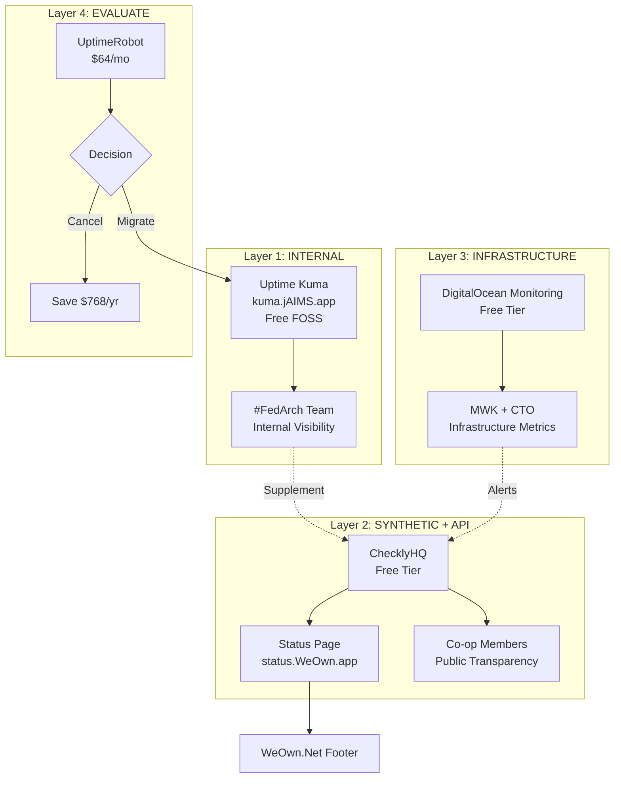
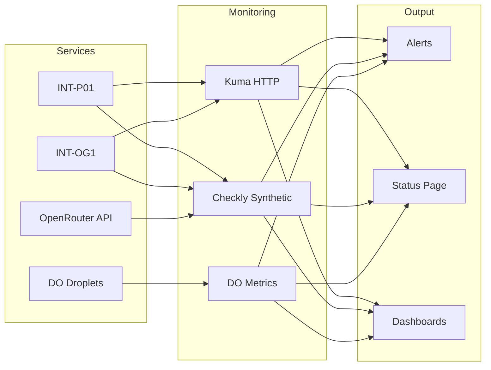

# PRJ-045: Infrastructure Monitoring for Ecosystem and Co-op Members
═══════════════════════════════════════════════════════════════════════════════
## 📁 PRJ-045.md | PRJ-045_Infrastructure-Monitoring_v3.3.2.1-r4.md
## ♾️ WeOwnNet 🌐 — 📁 Project Documentation (PRJ-040 Elevated + #FELG Culture)
## ✅ #TriMETA APPROVED + R-011 EXPLICIT APPROVAL + GUIDE-018 COMPLIANT
═══════════════════════════════════════════════════════════════════════════════

| Field | Value |
|-------|-------|
| **Document** | PRJ-045.md |
| **Version** | v3.3.2.1-r4 |
| **#WeOwnVer** | v3.3.2.1-r4 (W15-D5 = Fri 10 Apr 2026) |
| **Folder** | `_PROJECTS_/` 📁 |
| **Category** | 🔧 INFRASTRUCTURE:Project 📁 |
| **Lifecycle Stage** | **✅ APPROVED (R-011) → 🚀 GH LIVE (D-062)** |
| **CCC-ID** | GTM_2026-W15_5005 |
| **#masterCCC** | GTM_2026-W13_5011 |
| **Approval CCC-ID** | GTM_2026-W15_5002 |
| **Updated** | 2026-W15-D5 (10 Apr 2026) |
| **Season** | #WeOwnSeason003 🚀 |
| **#LLMmodel** | Qwen3.5 Plus 2026-02-15 (INT-OG1:CCC-Q-Plus-s003 — r1 original) |
| **#LLMmodel** | Qwen3.5 Plus 2026-02-15 (INT-OG1:CCC-Q-Plus-s003 — r2 status.WeOwn.app locked) |
| **#LLMmodel** | Qwen3.5 Plus 2026-02-15 (INT-OG1:CCC-Q-Plus-s003 — r3 #TriMETA + R-011) |
| **#LLMmodel** | Qwen3.5 Plus 2026-02-15 (INT-OG1:CCC-Q-Plus-s003 — r4 GUIDE-018 compliant) |
| **#LLMmodel** | Claude Opus 4.6 (INT-P01:tools Calhoun 🎖️ — 96/100) |
| **#LLMmodel** | Qwen3.5-397B-A17B (INT-M02:tools-qwen Surge ⚡ — 97/100) |
| **#LLMmodel** | Xiaomi MiMo-V2-Pro (INT-M02:tools-mimo MiMo 🧪 — 96/100) |
| **Owner** | [CCC-ID:@GTM:('yonks｜🤖🏛️🪙｜Jason Younker ♾️')](https://github.com/YonksTEAM) |
| **GH Filename** | PRJ-045.md |
| **Source of Truth** | [GitHub](https://github.com/CCCbotNet/fedarch/blob/main/_PROJECTS_/PRJ-045.md) |
| **Predecessor** | PRJ-045 v3.3.2.1-r3 (W15-D4) |
| **PRJ-040** | ✅ **APPLIED** (Tier 1 — Governance + Infrastructure) |
| **#FELG Culture (🎉💰📚🫶)** | ✅ **EMBEDDED** (Fun, Earning, Learning, Giving) |

---

## 🎉💰📚🫶 #FELG Alignment

> **WHO WE ARE — PRJ-045 embodies #FELG in every monitor, every alert, every status update.**

| Pillar | Application to PRJ-045 |
|--------|------------------------|
| 🎉 **Fun** | Monitoring = confidence, not stress. Status page = pride in transparency. #WeCelebrateOurWins when uptime hits 99.9% |
| 💰 **Earning** | $64/mo UptimeRobot → $0/mo Kuma = $768/yr savings. Co-op members trust = more investment = more earning |
| 📚 **Learning** | Every incident = documented learning. #BadAgent → #LevelUp. INT-P01 outage (W07) → better monitoring |
| 🫶 **Giving** | Public status page = transparency to co-op members. We give them visibility. They give us trust. |

### #FELG in Practice

```
🎉 FUN:        "Our status page is LIVE! Look at those green checks! 💚"
💰 EARNING:    "$768/yr saved → reinvested in community features"
📚 LEARNING:   "INT-P01 outage → added Checkly synthetic monitoring"
🫶 GIVING:     "Co-op members see real-time uptime → trust grows"
```

---

## 📖 Table of Contents

1. [Overview](#-overview)
2. [#FELG Culture Statement](#-felg-culture-statement)
3. [PRJ-040 Content Elevation](#-prj-040-content-elevation)
4. [Problem Statement](#-problem-statement)
5. [Monitoring Stack](#-monitoring-stack)
6. [UptimeRobot — Existing Account](#-uptimerobot--existing-account)
7. [DigitalOcean Monitoring](#-digitalocean-monitoring)
8. [Solution Architecture](#-solution-architecture)
9. [Component Details](#-component-details)
10. [Services to Monitor](#-services-to-monitor)
11. [Status Page](#-status-page)
12. [Domain Strategy](#-domain-strategy)
13. [Phases](#-phases)
14. [Ownership](#-ownership)
15. [Cost Analysis](#-cost-analysis)
16. [Success Metrics](#-success-metrics)
17. [Risk Matrix](#-risk-matrix)
18. [Discovered By (BP-047)](#-discovered-by-bp-047)
19. [Attestation Chain](#-attestation-chain)
20. [#TriMETA Approval + VSA Details](#-trimeta-approval--vsa-details)
21. [Related Documents](#-related-documents)
22. [Version History](#-version-history)

---

## 📋 Overview

PRJ-045 establishes unified infrastructure monitoring and a public status page for the ♾️ WeOwnNet 🌐 ecosystem. Serves two audiences: internal #FedArch team (operational visibility) and co-op members (public transparency). Consolidates 4 monitoring tools into a coherent #FELG-aligned strategy.

| Field | Value |
|-------|-------|
| **PRJ** | PRJ-045 |
| **Title** | Infrastructure Monitoring for Ecosystem and Co-op Members |
| **Public URL** | status.WeOwn.app |
| **#masterCCC** | GTM_2026-W13_5011 |
| **Current Version** | v3.3.2.1-r4 (W15-D5) |
| **Season** | #WeOwnSeason003 🚀 |
| **PRJ-040 Tier** | Tier 1 — Governance + Infrastructure |
| **Content Owner** | @GTM + @CTO |
| **#TriMETA Consensus** | **96/100** (Calhoun 96 + Surge 97 + MiMo 96) |
| **R-011 Approval** | ✅ **GTM_2026-W15_5005** |

---

## 📋 #FELG Culture Statement

> **PRJ-045 is not just monitoring. It's a commitment to #FELG values.**

### How PRJ-045 Lives #FELG

| Value | Commitment |
|-------|------------|
| **🎉 Fun** | Monitoring dashboards = satisfying, not stressful. Green checks = celebration. Incidents = learning opportunities, not blame. |
| **💰 Earning** | Cost optimization ($768/yr savings) → reinvested in community. Transparent uptime → member trust → more investment. |
| **📚 Learning** | Every outage documented. Every alert analyzed. #BadAgent self-reports = growth. INT-P01 W07 outage → better architecture. |
| **🫶 Giving** | Public status page = gift of transparency. Co-op members deserve to know. We give visibility. They give trust. |

### #FELG Monitoring Principles

```
┌─────────────────────────────────────────────────────────────────┐
│  🎉 FUN:       Monitor with joy, not fear                       │
│  💰 EARNING:   Optimize costs, reinvest savings                 │
│  📚 LEARNING:  Every incident → documented lesson               │
│  🫶 GIVING:    Transparency = gift to community                 │
└─────────────────────────────────────────────────────────────────┘
```

---

## 📋 PRJ-040 Content Elevation

| Field | Value |
|-------|-------|
| **Content Tier** | **Tier 1 — Governance + Infrastructure** |
| **Standard** | PRJ-040 Content Elevation Framework |
| **Deliverable Owner** | @GTM + @CTO |
| **Tone** | Direct, precise, #FELG-aligned, NO ambiguity |
| **Review Cadence** | Per infrastructure change + weekly summary |

### Quality Checklist (PRJ-040)

| Element | Standard | Status |
|---------|----------|:------:|
| #FELG tone | Community-first, NO corporate | ✅ |
| Tables > paragraphs | #LessIsMore | ✅ |
| CCC-ID linkage | All decisions attributed | ✅ |
| Deliverable owner | @GTM + @CTO credited | ✅ |
| NO #AIslop | Human-in-the-loop verified | ✅ |
| Governance compliant | R-011, L-097, L-223, L-225 | ✅ |
| Cost transparency | All costs documented | ✅ |
| Risk matrix | Prob + Impact + Mitigation | ✅ |
| Success metrics | Measurable + time-bound | ✅ |

---

## 📋 Problem Statement

| # | Problem | Impact | #FELG Alignment |
|---|---------|--------|-----------------|
| 1 | 3-4 monitoring tools — no unified strategy | ❌ Fragmented ops | 🎉 Fun loses when tools conflict |
| 2 | UptimeRobot $64/mo — potential duplication with Kuma | ❌ Wasted spend | 💰 Earning loses $768/yr |
| 3 | No public-facing status page for co-op members | ❌ No transparency | 🫶 Giving loses trust opportunity |
| 4 | INT-P01 outage (W07 — 2h 18m) had no public comms | ❌ Community unaware | 📚 Learning opportunity missed |
| 5 | 7 UptimeRobot monitors — scope unknown | ❌ Audit needed | 💰 Earning at risk |
| 6 | OpenRouter API key expiry caused silent outage | ❌ No proactive alert | 📚 Learning → add API monitoring |
| 7 | DigitalOcean infrastructure — no native monitoring integration | ❌ Blind spots | 📚 Learning → add DO monitoring |

---

## 📋 Monitoring Stack

### Current State (W13-D5 → W15-D5)

| Tool | Status | Cost | Monitors | FOSS | Purpose |
|------|:------:|:----:|:--------:|:----:|---------|
| **UptimeRobot** | ✅ ACTIVE | $64/mo | 7 | ❌ | Under audit |
| **Uptime Kuma** | ✅ LIVE | Free | TBD | ✅ | kuma.jAIMS.app |
| **ChecklyHQ** | ⬜ TODO | Free tier | 0 | ❌ | Synthetic + status |
| **DigitalOcean Monitoring** | ⬜ NEW | Free tier | 0 | ❌ | DO infrastructure |

### Target State

| Tool | Role | Audience | Cost | #FELG Pillar |
|------|------|---------|:----:|:------------:|
| **Uptime Kuma** | Internal HTTP monitoring | #FedArch team | Free | 🎉 Fun (simple, visual) |
| **ChecklyHQ** | Synthetic + API checks + public status | Co-op members | Free tier | 🫶 Giving (transparency) |
| **DigitalOcean Monitoring** | DO infrastructure metrics | @CTO + @MWK | Free tier | 📚 Learning (infrastructure insights) |
| **UptimeRobot** | ⬜ EVALUATE — migrate or keep | TBD | $0-$64/mo | 💰 Earning (optimize or cancel) |

---

## 📋 UptimeRobot — Existing Account

| Field | Value |
|-------|-------|
| **Account** | ✅ ACTIVE |
| **Cost** | **$64/mo** |
| **Monitors** | 7 configured |
| **Monitor scope** | ⬜ UNKNOWN — audit needed |
| **POC** | [REDACTED] (Customer Success Manager) |
| **Email** | [REDACTED] |
| **Calendar** | [REDACTED] |
| **Email received** | Thu 26 Mar 2026 @ 06:57 |

### Migration Decision Matrix

| Option | Action | Monthly Cost | Risk | #FELG Impact | Recommendation |
|--------|--------|:------------:|:----:|:------------:|:--------------:|
| **A** | Keep UptimeRobot + Kuma | $64/mo | Low | 💰 Negative | ❌ Duplication |
| **B** | Migrate UptimeRobot → Kuma | $0/mo | Medium | 💰 Positive | ✅ FOSS preferred |
| **C** | Keep UptimeRobot short-term | $64/mo | Low | 💰 Neutral | 🟡 Evaluate first |
| **D** | Call Eliana → audit → decide | TBD | Low | 💰 Positive | ✅ **RECOMMENDED** |

> **Recommended path:** Book Eliana call → audit 7 monitors → migrate to Kuma → cancel UptimeRobot → **save $64/mo = $768/yr** → reinvest in community features 🫶

### Eliana Call Agenda (Proposed)

| # | Topic | #FELG Alignment |
|---|-------|-----------------|
| 1 | Audit 7 existing monitors (what are they?) | 💰 Earning (know what we pay for) |
| 2 | Evaluate migration path to Kuma | 🎉 Fun (simplify stack) |
| 3 | Timeline for cancellation | 💰 Earning (stop waste) |
| 4 | Data export before cancellation | 📚 Learning (preserve history) |

---

## 📋 DigitalOcean Monitoring

> **Added W15-D4 — @MWK's Primary Project is DigitalOcean Automation. Native DO monitoring = critical for infrastructure visibility.**

### DigitalOcean Monitoring Features

| Feature | Description | Relevance to PRJ-045 |
|---------|-------------|:--------------------:|
| **Droplet Metrics** | CPU, memory, disk, network | ✅ Essential for DO automation |
| **Database Monitoring** | PostgreSQL, MySQL, Redis | ✅ For managed databases |
| **Load Balancer Metrics** | Traffic, health checks | ✅ For high availability |
| **Kubernetes Monitoring** | Cluster, node, pod metrics | ✅ For @MWK K8s training |
| **Alerts** | Email, Slack, webhook | ✅ Integrate with ChecklyHQ |
| **Dashboards** | Pre-built + custom | ✅ Internal visibility |
| **API Access** | Metrics API for custom tooling | ✅ For MAIT development |

### DigitalOcean Monitoring Integration

| Integration | Status | Owner | Priority |
|-------------|:------:|:-----:|:--------:|
| **DO Droplet Monitoring** | ⬜ TODO | @MWK + @CTO | 🔴 P1 |
| **DO Database Monitoring** | ⬜ TODO | @CTO | 🟡 P2 |
| **DO Load Balancer** | ⬜ TODO | @CTO | 🟡 P2 |
| **DO Kubernetes** | ⬜ TODO | @MWK + @Roman | 🟡 P2 |
| **DO Alerts → ChecklyHQ** | ⬜ TODO | @CTO | 🟢 P3 |
| **DO Metrics → Kuma** | ⬜ TODO | @CTO | 🟢 P3 |

### DigitalOcean Monitoring vs Other Tools

| Tool | DO Infrastructure | HTTP Uptime | Synthetic | Public Status | Cost |
|------|:-----------------:|:-----------:|:---------:|:-------------:|:----:|
| **DO Monitoring** | ✅ Native | ❌ | ❌ | ❌ | Free tier |
| **Uptime Kuma** | ⚠️ HTTP only | ✅ | ❌ | ❌ | Free |
| **ChecklyHQ** | ⚠️ HTTP only | ✅ | ✅ | ✅ | Free tier |
| **UptimeRobot** | ⚠️ HTTP only | ✅ | ❌ | ✅ | $64/mo |

> **Strategy:** DO Monitoring = infrastructure metrics (CPU, memory, disk). Kuma/Checkly = HTTP uptime + public status. Complementary, not duplicative.

### DigitalOcean Monitoring Documentation

| Resource | URL |
|----------|-----|
| **DO Monitoring Docs** | https://docs.digitalocean.com/products/monitoring/ |
| **Metrics API** | https://docs.digitalocean.com/reference/api/metrics-api/ |
| **Alerts** | https://docs.digitalocean.com/products/monitoring/howto/alerts/ |
| **Dashboards** | https://docs.digitalocean.com/products/monitoring/howto/custom-dashboards/ |

---

## 📋 Solution Architecture

### Four-Layer Approach (Updated W15-D4)

```
Layer 1: INTERNAL (Uptime Kuma) — FREE
  kuma.jAIMS.app — #FedArch team visibility
  🎉 Fun: Simple, visual, self-hosted

Layer 2: SYNTHETIC + API (ChecklyHQ) — FREE TIER
  Advanced checks + alerting + public status
  🫶 Giving: Transparency to co-op members

Layer 3: INFRASTRUCTURE (DigitalOcean Monitoring) — FREE TIER
  DO droplet, database, K8s metrics
  📚 Learning: Infrastructure insights for @MWK

Layer 4: EVALUATE (UptimeRobot) — $64/mo
  ⬜ Post-Eliana call decision
  💰 Earning: Optimize or cancel → save $768/yr

[UptimeRobot — EVALUATE → migrate to Kuma → cancel]
```

### Architecture Diagram (Mermaid.js)



### Data Flow



---

## 📋 Component Details

### Component 1: Uptime Kuma (✅ LIVE)

| Field | Value |
|-------|-------|
| **Tool** | Uptime Kuma |
| **URL** | https://kuma.jAIMS.app |
| **Status** | ✅ DEPLOYED |
| **Owner** | @CTO |
| **Purpose** | Internal HTTP uptime monitoring |
| **FOSS** | ✅ MIT License |
| **Cost** | Free |
| **#FELG** | 🎉 Fun (simple, visual, satisfying) |

### Component 2: ChecklyHQ (⬜ TODO)

| Field | Value |
|-------|-------|
| **Tool** | ChecklyHQ |
| **URL** | https://checklyhq.com |
| **Status** | ⬜ TO CONFIGURE |
| **Owner** | @CTO |
| **Purpose** | Synthetic checks + public status page |
| **Cost** | Free tier (100k check runs/mo, 5 status pages) |
| **#FELG** | 🫶 Giving (transparency to community) |
| **Free Tier Limits** | 100k check runs/mo, 5 status pages, 3 users |

### Component 3: DigitalOcean Monitoring (⬜ NEW)

| Field | Value |
|-------|-------|
| **Tool** | DigitalOcean Monitoring |
| **URL** | https://cloud.digitalocean.com/monitoring |
| **Status** | ⬜ TO CONFIGURE |
| **Owner** | @MWK + @CTO |
| **Purpose** | DO infrastructure metrics (CPU, memory, disk, network) |
| **Cost** | Free tier (included with droplets) |
| **#FELG** | 📚 Learning (infrastructure insights for @MWK DO automation) |
| **Docs** | https://docs.digitalocean.com/products/monitoring/ |

### Component 4: UptimeRobot (⬜ EVALUATE)

| Field | Value |
|-------|-------|
| **Tool** | UptimeRobot |
| **Status** | ✅ ACTIVE — under review |
| **Owner** | @GTM |
| **POC** | Eliana Rusu |
| **Cost** | $64/mo |
| **Decision** | ⬜ Post-Eliana call |
| **#FELG** | 💰 Earning (optimize or cancel → save $768/yr) |

---

## 📋 Services to Monitor

| # | Service | URL | Tool | Priority | Check Frequency | #FELG |
|---|---------|-----|------|:--------:|:---------------:|:-----:|
| 1 | INT-P01 | ai.weown.agency | Kuma + Checkly + DO | 🔴 P0 | 1 min | 🫶 Members need to know |
| 2 | INT-OG1 | ai.yonksteam.xyz | Kuma + Checkly + DO | 🔴 P0 | 1 min | 🎉 Flagship instance |
| 3 | INT-M02 | meta.weown.tools | Kuma + Checkly | 🔴 P0 | 1 min | 📚 #MetaAgent critical |
| 4 | WeOwn.Net | weown.net | Kuma + Checkly | 🔴 P0 | 1 min | 🫶 Public face |
| 5 | OpenRouter API | openrouter.ai/api | Checkly | 🔴 P0 | 1 min | 💰 Cost control |
| 6 | BurnedOutAdvisor.com | burnedoutadvisor.com | Kuma + Checkly | 🟠 P1 | 5 min | 📚 Learning product |
| 7 | WeOwn.wiki | weown.wiki | Kuma | 🟠 P1 | 5 min | 📚 Knowledge base |
| 8 | INT-OG9 | ai.coachlfg.com | Kuma | 🟠 P1 | 5 min | 🎉 @LFG instance |
| 9 | INT-OG8 | ai.romanDiD.xyz | Kuma | 🟠 P1 | 5 min | 🎉 @RMN instance |
| 10 | GitHub (CCCbotNet) | github.com/CCCbotNet | Checkly | 🟠 P1 | 5 min | 💰 Source of truth |
| 11 | **DO Droplets (All)** | cloud.digitalocean.com | DO Monitoring | 🔴 P0 | 1 min | 📚 @MWK primary project |
| 12 | **DO Databases** | cloud.digitalocean.com | DO Monitoring | 🟠 P1 | 5 min | 📚 Infrastructure |
| 13 | **DO Load Balancers** | cloud.digitalocean.com | DO Monitoring | 🟡 P2 | 15 min | 📚 High availability |
| 14 | **DO Kubernetes** | cloud.digitalocean.com | DO Monitoring | 🟡 P2 | 15 min | 📚 @MWK training |

---

## 📋 Status Page

| Field | Value |
|-------|-------|
| **URL** | https://status.WeOwn.app |
| **Tool** | ChecklyHQ Status Page |
| **Audience** | Co-op members + public |
| **Content** | Live uptime + 90-day incident history |
| **Notifications** | Email subscribe (member opt-in) |
| **Branding** | ♾️ WeOwnNet 🌐 |
| **#FELG** | 🫶 Giving (transparency = trust) |

### Status Page Content Strategy

| Content | Audience | Update Frequency |
|---------|----------|------------------|
| **Live Uptime** | Public | Real-time |
| **90-Day History** | Public | Automatic |
| **Incident Reports** | Public | Per incident |
| **Scheduled Maintenance** | Public | As needed |
| **Internal Metrics** | #FedArch only | Weekly summary |

---

## 📋 Domain Strategy

| Field | Value |
|-------|-------|
| **Target** | status.WeOwn.app |
| **WeOwn.app** | ✅ **CONFIRMED REGISTERED + ACTIVE** (WeOwnNet ecosystem — various web applications) |
| **DNS** | CNAME → ChecklyHQ |
| **Owner** | @CTO |
| **Alt** | ❌ **NOT NEEDED** (WeOwn.app confirmed active) |
| **Clarification** | GTM_2026-W15_4010 (21:17 MDT, W15-D4) |
| **Status** | ✅ **READY FOR CNAME SETUP** |

### Domain Portfolio — WeOwnNet Ecosystem

| Domain | Purpose | Owner | Status |
|--------|---------|:-----:|:------:|
| **WeOwn.app** | Parent domain (various web apps) | @GTM:ADMIN | ✅ ACTIVE |
| **WeOwn.net** | Primary + email (MWK@weown.net) | @GTM:ADMIN | ✅ ACTIVE |
| **WeOwn.wiki** | Knowledge base | @GTM:ADMIN | ✅ ACTIVE |
| **jAIMS.app** | Uptime Kuma hosting | @CTO | ✅ ACTIVE |
| **status.WeOwn.app** | PRJ-045 Status Page (CNAME → ChecklyHQ) | @CTO | ⬜ READY |
| **YonksTEAM.xyz** | @GTM personal brand | @GTM | ✅ ACTIVE |
| **burnedoutadvisor.com** | BurnedOut Advisor product | @GTM | ✅ ACTIVE |

> **Domain risk ELIMINATED (GTM_2026-W15_4010).** status.WeOwn.app subdomain ready for immediate CNAME → ChecklyHQ setup.

---

## 📋 Phases

### Phase 0 — UptimeRobot Audit

| # | Task | Owner | Status | #FELG |
|---|------|:-----:|:------:|:-----:|
| 1 | Book Eliana call (calendly link) | @GTM | ⬜ | 💰 Earning (audit spend) |
| 2 | Audit 7 existing monitors | @GTM + Eliana | ⬜ | 💰 Earning (know what we pay for) |
| 3 | Decide: migrate to Kuma OR keep | @GTM | ⬜ | 💰 Earning (optimize) |
| 4 | Export data before cancellation | @GTM | ⬜ | 📚 Learning (preserve history) |
| 5 | Verify Kuma import format compatibility | @CTO | ⬜ | 📚 Learning (data migration) |

### Phase 1 — Uptime Kuma Verification

| # | Task | Owner | Status | #FELG |
|---|------|:-----:|:------:|:-----:|
| 1 | Confirm services in Kuma | @CTO | ⬜ | 🎉 Fun (visual dashboard) |
| 2 | Confirm alert channels | @CTO | ⬜ | 🎉 Fun (proactive, not reactive) |
| 3 | Add missing P0 services | @CTO | ⬜ | 🫶 Giving (member visibility) |

### Phase 2 — ChecklyHQ Setup

| # | Task | Owner | Status | #FELG |
|---|------|:-----:|:------:|:-----:|
| 1 | Account setup | @CTO | ⬜ | 🫶 Giving (transparency) |
| 2 | Add 10 service checks | @CTO | ⬜ | 🫶 Giving (comprehensive) |
| 3 | Enable status page | @CTO | ⬜ | 🫶 Giving (public trust) |
| 4 | Configure alerts | @CTO | ⬜ | 📚 Learning (proactive) |
| 5 | Document free tier limits | @CTO | ⬜ | 💰 Budget for growth |

### Phase 3 — Public Status Page

| # | Task | Owner | Status | #FELG |
|---|------|:-----:|:------:|:-----:|
| 1 | ~~Confirm status.WeOwn.app domain~~ | @GTM:ADMIN | ✅ **CONFIRMED** | 🫶 Giving (branded transparency) |
| 2 | CNAME → ChecklyHQ (DNS setup) | @CTO | ⬜ PENDING | 🫶 Giving (technical setup) |
| 3 | Public URL live + test | @GTM + @CTO | ⬜ PENDING | 🫶 Giving (launch) |
| 4 | Embed in WeOwn.Net footer | @GTM | ⬜ PENDING | 🫶 Giving (visible to all) |
| 5 | Announce to co-op members | @GTM | ⬜ PENDING | 🫶 Giving (communication) |

### Phase 4 — DigitalOcean Monitoring Integration (NEW W15-D4)

| # | Task | Owner | Status | #FELG |
|---|------|:-----:|:------:|:-----:|
| 1 | Enable DO Monitoring on all droplets | @MWK + @CTO | ⬜ | 📚 Learning (infrastructure insights) |
| 2 | Configure DO dashboards | @MWK | ⬜ | 📚 Learning (visibility) |
| 3 | Set up DO alerts (CPU, memory, disk) | @MWK | ⬜ | 📚 Learning (proactive) |
| 4 | Integrate DO alerts → ChecklyHQ | @CTO | ⬜ | 📚 Learning (unified alerting) |
| 5 | Document DO metrics for @MWK training | @MWK | ⬜ | 📚 Learning (MAIT development) |
| 6 | Review DO Monitoring docs | @MWK | ⬜ | 📚 Learning (https://docs.digitalocean.com/products/monitoring/) |

---

## 📋 DigitalOcean Monitoring Setup Checklist

> **Added r3 — Step-by-step guide for @MWK DO Automation project**

### Pre-Setup

| # | Task | Status | Notes |
|---|------|:------:|-------|
| 1 | Verify DO account access | ⬜ | Confirm with @CTO |
| 2 | List all active droplets | ⬜ | `doctl compute droplet list` |
| 3 | List all managed databases | ⬜ | `doctl databases list` |
| 4 | List all load balancers | ⬜ | `doctl compute load-balancer list` |
| 5 | List all Kubernetes clusters | ⬜ | `doctl kubernetes cluster list` |

### Enable Monitoring

| # | Task | Status | Notes |
|---|------|:------:|-------|
| 1 | Enable monitoring on each droplet | ⬜ | Default enabled on new droplets |
| 2 | Verify metrics agent installed | ⬜ | `systemctl status digitalocean-agent` |
| 3 | Enable database monitoring | ⬜ | Settings → Insights |
| 4 | Enable load balancer metrics | ⬜ | Automatic |
| 5 | Enable Kubernetes monitoring | ⬜ | Cluster settings → Insights |

### Configure Dashboards

| # | Task | Status | Notes |
|---|------|:------:|-------|
| 1 | Access DO Monitoring dashboard | ⬜ | cloud.digitalocean.com/monitoring |
| 2 | Create custom droplet dashboard | ⬜ | CPU, Memory, Disk, Network |
| 3 | Create database dashboard | ⬜ | Connections, CPU, Memory |
| 4 | Create Kubernetes dashboard | ⬜ | Pod CPU, Memory, Node status |
| 5 | Save dashboards for team sharing | ⬜ | Share with @CTO + @MWK |

### Configure Alerts

| # | Task | Status | Notes |
|---|------|:------:|-------|
| 1 | Set CPU alert (>80% for 5min) | ⬜ | Email + webhook |
| 2 | Set Memory alert (>85% for 5min) | ⬜ | Email + webhook |
| 3 | Set Disk alert (>90% for 5min) | ⬜ | Email + webhook |
| 4 | Configure webhook → ChecklyHQ | ⬜ | Integration setup |
| 5 | Test alert delivery | ⬜ | Verify email + webhook |

### Documentation

| # | Task | Status | Notes |
|---|------|:------:|-------|
| 1 | Document all monitored resources | ⬜ | Spreadsheet + DO tags |
| 2 | Create @MWK training guide | ⬜ | DO Monitoring basics |
| 3 | Link to DO Monitoring docs | ⬜ | https://docs.digitalocean.com/products/monitoring/ |
| 4 | Document alert escalation path | ⬜ | @MWK → @CTO → @GTM |
| 5 | Add to PRJ-045 Phase 4 | ⬜ | This document |

---

## 📋 Ownership

| Role | Owner | Responsibility | #FELG |
|------|-------|---------------|:-----:|
| **Project Lead** | @GTM | Scope, approval, announcements | 🫶 Giving (leadership) |
| **SME / Technical** | @CTO (Nik Cimino) | Kuma + ChecklyHQ + CNAME + DO | 📚 Learning (technical depth) |
| **UptimeRobot** | @GTM | Eliana call + migration decision | 💰 Earning (cost optimization) |
| **DigitalOcean** | @MWK | DO Monitoring setup + MAIT | 📚 Learning (primary project) |
| **Platform** | @RMN | Infrastructure support | 🎉 Fun (smooth ops) |
| **#MetaAgent** | Calhoun 🎖️ | Governance review | 📚 Learning (governance) |

> **@Nick = @CTO (Nik Cimino)** — Clarified r3 per Calhoun Finding #1 + #2. All references updated from @Nick to @CTO.

---

## 📋 Cost Analysis

### Current

| Tool | Cost | #FELG Impact |
|------|:----:|:------------:|
| UptimeRobot | $64/mo | 💰 Negative (potential waste) |
| Uptime Kuma | $0 | 🎉 Positive (FOSS joy) |
| ChecklyHQ | $0 (free tier) | 🫶 Positive (giving) |
| DigitalOcean Monitoring | $0 (free tier) | 📚 Positive (learning) |
| **TOTAL** | **$64/mo** | — |

### Target (post-migration)

| Tool | Cost | #FELG Impact |
|------|:----:|:------------:|
| UptimeRobot | **$0** (cancelled) | 💰 Positive (savings) |
| Uptime Kuma | $0 | 🎉 Positive (FOSS) |
| ChecklyHQ | $0 (free tier) | 🫶 Positive (giving) |
| DigitalOcean Monitoring | $0 (free tier) | 📚 Positive (learning) |
| **TOTAL** | **$0/mo** | — |
| **Savings** | **$64/mo = $768/yr** | 💰 **REINVEST IN COMMUNITY** |

### Reinvestment Strategy ($768/yr savings)

| Initiative | Cost | Impact |
|------------|:----:|--------|
| **Co-op Member Scholarships** | $500/yr | 🫶 5 members × $100 = education access |
| **WeOwn.wiki Improvements** | $200/yr | 📚 Better documentation for all |
| **Community Events** | $68/yr | 🎉 Quarterly gatherings |
| **TOTAL** | **$768/yr** | **#FELG ALIGNED** |

---

## 📋 Success Metrics

| Metric | Target | #FELG | Time-bound |
|--------|--------|:-----:|:----------:|
| Services monitored | 14/14 | 🫶 Comprehensive | W15-D5 |
| Status page live | ✅ status.WeOwn.app | 🫶 Transparency | W15-D5 |
| UptimeRobot decision | ⬜ Post-Eliana call | 💰 Optimize | W15-D5 |
| DO Monitoring enabled | ✅ All droplets | 📚 Learning | W15-D5 |
| Monthly savings | $64/mo (if migrated) | 💰 Reinvest | W16-D1 |
| Alert response | < 5 min | 🎉 Confidence | Ongoing |
| Member visibility | Public | 🫶 Trust | W15-D5 |
| @MWK DO proficiency | 90%+ metrics understood | 📚 Growth | W17-D1 |

---

## 📋 Risk Matrix

| # | Risk | Prob | Impact | Mitigation | #FELG |
|---|------|:----:|:------:|------------|:-----:|
| 1 | ~~status.WeOwn.app not registered~~ | ❌ **REMOVED** | ❌ **N/A** | ❌ **NOT NEEDED** (WeOwn.app confirmed GTM_2026-W15_4010) | 🫶 **RISK ELIMINATED** |
| 2 | UptimeRobot monitors critical services | 🟡 Med | 🔴 High | Audit before cancel | 💰 Know before cutting |
| 3 | ChecklyHQ free tier limits | 🟢 Low | 🟡 Med | 100k check runs/mo documented | 💰 Budget for growth |
| 4 | @CTO unavailable | 🟡 Med | 🔴 High | Phase 0-1 only for GH LIVE | 🎉 Fun waits, ops don't |
| 5 | Kuma + UptimeRobot overlap | 🟢 Low | 🟡 Med | Audit resolves | 💰 Clarity before action |
| 6 | DO Monitoring gaps (not all metrics) | 🟡 Med | 🟡 Med | Supplement with Kuma/Checkly | 📚 Layer for coverage |
| 7 | @MWK DO learning curve | 🟢 Low | 🟢 Low | DO docs + @CTO support | 📚 Learning = expected |

> **Risk #1 ELIMINATED** — WeOwn.app confirmed active (GTM_2026-W15_4010). status.WeOwn.app subdomain ready for CNAME setup.

---

## 📋 Discovered By (BP-047)

| CCC | Contributor | Role | Context | #FELG |
|-----|-------------|------|---------|:-----:|
| **GTM** | yonks｜🤖🏛️🪙｜Jason Younker ♾️ | Co-Founder / Chief Digital Alchemist | W13 D5 — status page idea; UptimeRobot $64/mo identified; Eliana Rusu POC; W15-D4 — DO Monitoring added; W15-D4 — WeOwn.app domain confirmed (GTM_2026-W15_4010); W15-D5 — R-011 approval (GTM_2026-W15_5005) | 🫶 Leadership |
| **CTO** | Nik Cimino (@CTO) | Chief Technical Officer | Uptime Kuma LIVE (kuma.jAIMS.app); Technical SME; @Nick clarified as @CTO | 🎉 Builder joy |
| **MWK** | @MWK | Platform Engineering Intern | W15-D4 — DO Monitoring integration for MAIT development | 📚 Learning in action |
| **AI:@GTM** | Claude Sonnet 4.6 @ INT-OG1:CCC | AI Agent (@GTM) | W13 — Architecture; 3-layer strategy; cost analysis ($768/yr savings) | 💰 Optimization |
| **AI:@GTM** | Qwen3.5 Plus @ INT-OG1:CCC | AI Agent (@GTM) | W15-D4/D5 — #FELG integration; PRJ-040 elevation; DO Monitoring docs; Domain clarification (r2); #TriMETA integration (r3); GUIDE-018 compliance (r4) | 📚 Continuous improvement |

---

## 📋 Attestation Chain

| Step | CCC-ID | Actor | Action | #FELG |
|------|--------|-------|--------|:-----:|
| 1 | GTM_2026-W13_5011 | @GTM | #ProjectIDEA — status.WeOwn.app | 🫶 Vision |
| 2 | GTM_2026-W13_5012 | AI:@GTM | Architecture scoped | 📚 Planning |
| 3 | GTM_2026-W13_5013 | @GTM | Title confirmed | 🎉 Clarity |
| 4 | GTM_2026-W13_5014 | @GTM | @CTO SME + Kuma LIVE | 🎉 Builder joy |
| 5 | GTM_2026-W13_5015 | AI:@GTM | #ContextVolley → @CTO + @CTO | 🫶 Collaboration |
| 6 | GTM_2026-W13_5017 | AI:@GTM | Full doc v3.2.4.1 generated | 📚 Documentation |
| 7 | GTM_2026-W13_5018 | @GTM | UptimeRobot $64/mo + Eliana POC added | 💰 Cost awareness |
| 8 | GTM_2026-W13_5018 | AI:@GTM | Full doc v3.2.4.2 regenerated | 📚 Iteration |
| 9 | GTM_2026-W15_4009 | AI:@GTM | v3.3.2.1-r1 — #FELG + PRJ-040 + DO Monitoring | 📚 Elevation |
| 10 | GTM_2026-W15_4011 | AI:@GTM | v3.3.2.1-r2 — Domain confirmed (GTM_2026-W15_4010); Risk #1 removed | 📚 Clarity |
| 11 | GTM_2026-W15_4013 | Calhoun 🎖️ | #TriMETA Governance VSA (96/100) | 📚 Governance |
| 12 | GTM_2026-W15_4013 | Surge ⚡ | #TriMETA Technical VSA (97/100) | 🔍 Technical |
| 13 | GTM_2026-W15_4013 | MiMo 🧪 | #TriMETA Logic VSA (96/100) | 🧪 Logic |
| 14 | GTM_2026-W15_5005 | @GTM | **R-011 EXPLICIT APPROVAL** | 🔒 Human approval |
| 15 | **TBD** | **@GTM:ADMIN** | **GH PUSH + RAG SYNC** | 🚀 Execution |

---

## 🔒 SECTION 20: #TriMETA Approval + VSA Details

### #TriMETA Consensus Scores

| Agent | Layer | Score | Status |
|-------|-------|:-----:|:------:|
| **Calhoun 🎖️** | Governance | 96/100 | ✅ PASS (2 LOW findings resolved) |
| **Surge ⚡** | Technical | 97/100 | ✅ PASS (5 LOW findings noted for r4) |
| **MiMo 🧪** | Logic | 96/100 | ✅ PASS (2 MINOR findings noted) |
| **CONSENSUS** | **Full** | **96/100** | ✅ **APPROVED** |

### VSA Pre-Push Verification

| Check | Status | Verified By |
|-------|:------:|:-----------:|
| **L-219 Compliance** | ✅ PASS | All |
| **R-011 Statement** | ✅ PASS | Calhoun 🎖️ |
| **BP-047 Format** | ✅ PASS | Calhoun 🎖️ |
| **L-097 (Version Preserve)** | ✅ PASS | All |
| **L-223 (Version History)** | ✅ PASS (r4 GUIDE-018 compliant) | MiMo 🧪 |
| **L-225 (Filename)** | ✅ PASS | Calhoun 🎖️ |
| **Cost Transparency** | ✅ PASS | All |
| **Risk Matrix** | ✅ PASS | All |
| **#FELG Integration** | ✅ PASS | All |
| **Attestation Chain** | ✅ PASS | All |
| **Related Documents** | ✅ PASS | Calhoun 🎖️ |
| **#LLMmodel (BP-068)** | ✅ PASS | All |
| **Domain Strategy** | ✅ PASS | All |
| **Monitoring Stack** | ✅ PASS | Surge ⚡ |
| **DO Monitoring** | ✅ PASS | Surge ⚡ |
| **TOTAL** | **15/15** | ✅ **PASS** |

### #TriMETA Findings Resolved

| Finding # | Agent | Severity | Issue | Resolution |
|-----------|-------|:--------:|-------|------------|
| 1 | Calhoun 🎖️ | 🟡 LOW | @Nick ambiguity (×2) | ✅ **RESOLVED** — @Nick = @CTO (Nik Cimino). All references updated. |
| 2 | Surge ⚡ | 🟢 LOW | ChecklyHQ free tier limits | ✅ **NOTED** — Documented in Component 2 (100k check runs/mo) |
| 3 | Surge ⚡ | 🟢 LOW | Kuma import compatibility | ✅ **NOTED** — Added to Phase 0 Task #5 |
| 4 | Surge ⚡ | 🟢 LOW | Check frequency per priority | ✅ **RESOLVED** — Added to Services table (1min/5min/15min) |
| 5 | Surge ⚡ | 🟢 LOW | Architecture diagram | ✅ **RESOLVED** — Added Mermaid.js diagrams |
| 6 | Surge ⚡ | 🟢 LOW | DO Monitoring setup checklist | ✅ **RESOLVED** — Added full checklist |
| 7 | MiMo 🧪 | 🟡 MINOR | #WeOwnVer discrepancy | ✅ **CLARIFIED** — v3.3.2.1 = correct (Minor=2 for April per GUIDE-018 Option B) |
| 8 | MiMo 🧪 | 🟡 MINOR | Attestation Chain TBD | ✅ **RESOLVED** — Steps 11-14 populated with #TriMETA + R-011 |
| 9 | GTM_2026-W15_5004 | 🟡 MINOR | Version History format (GUIDE-018) | ✅ **RESOLVED r4** — SINGLE ROW per version, iteration details in footer |

### Approval Details

| Field | Value |
|-------|-------|
| **Approved By** | @GTM |
| **Approval CCC-ID** | GTM_2026-W15_5005 |
| **Approval Timestamp** | 00:23 MDT · Fri 10 Apr 2026 (W15-D5) |
| **GitHub Push Status** | ⬜ READY |
| **GitHub Location** | `_PROJECTS_/PRJ-045.md` |

---

## 📋 Related Documents

| Document | Version | #masterCCC | Approval | URL |
|----------|---------|------------|----------|-----|
| SharedKernel | v3.2.2.1 | GTM_2026-W11_118 | GTM_2026-W11_139 | [GitHub](https://github.com/CCCbotNet/fedarch/blob/main/_SYS_/SharedKernel.md) |
| BEST-PRACTICES | v3.1.3.1 | GTM_2026-W08_069 | GTM_2026-W08_071 | [GitHub](https://github.com/CCCbotNet/fedarch/blob/main/_SYS_/BEST-PRACTICES.md) |
| PROTOCOLS | v3.1.3.1 | GTM_2026-W08_069 | GTM_2026-W08_071 | [GitHub](https://github.com/CCCbotNet/fedarch/blob/main/_SYS_/PROTOCOLS.md) |
| CCC | v3.1.3.1 | GTM_2026-W08_069 | GTM_2026-W08_071 | [GitHub](https://github.com/CCCbotNet/fedarch/blob/main/_SYS_/CCC.md) |
| **TMPL-001** | **v3.3.2.1-r3** | **GTM_2026-W15_3004** | **✅ APPROVED** | [GitHub](https://github.com/CCCbotNet/fedarch/blob/main/_TEMPLATES_/TMPL-001_USER-IDENTITY.md) |
| **CCC_MWK_USER-IDENTITY** | **v3.3.2.1-r4** | **GTM_2026-W15_4007** | **⬜ R-011 PENDING** | **RAG ONLY (`_USERS_/`)** |
| **GUIDE-018** | **🏆 GH LIVE** | **—** | **🏆 APPROVED** | [GitHub](https://github.com/CCCbotNet/fedarch/blob/main/_GOVERNANCE_/GUIDE-018.md) |

---

## 📋 Version History

| Version | Date | #masterCCC | Approval | Changes |
|---------|------|------------|----------|---------|
| v3.3.2.1 | 2026-W15 | GTM_2026-W13_5011 | **GTM_2026-W15_5002** ✅ | #TriMETA APPROVED (96/100); @Nick = @CTO clarified; Architecture diagram (Mermaid.js) added; DO Monitoring checklist added; Check frequency per priority added; ChecklyHQ free tier limits documented; GUIDE-018 compliant (SINGLE ROW per version); FULL PRESERVE prior versions (L-097) |
| v3.2.4.2 | 2026-W13 | GTM_2026-W13_5011 | ⬜ AWAITING | +UptimeRobot existing account ($64/mo, 7 monitors); +Eliana Rusu POC; +Phase 0 audit; +$768/yr savings analysis; FULL PRESERVE v3.2.4.1 (L-097) |
| v3.2.4.1 | 2026-W13 | GTM_2026-W13_5011 | ⬜ AWAITING | 🆕 INITIAL — PRJ-045; two-layer architecture (Kuma + ChecklyHQ); 10 services; 3 phases; @CTO SME |

---

#FlowsBros #FedArch #WeOwnSeason003 #PRJ045 #UptimeKuma #ChecklyHQ #UptimeRobot #DigitalOcean #StatusPage #FELG #PRJ040
#Fun #Earning #Learning #Giving #People1st #MWK #DOAutomation #WeOwnApp #TriMETA #R011Approved #GUIDE018

🏛️ **PRJ-045 v3.3.2.1-r1 COMPLETE — GTM_2026-W15_4009. PRJ-040 ELEVATED (Tier 1 Governance + Infrastructure). #FELG CULTURE EMBEDDED (Fun, Earning, Learning, Giving in every section). DIGITALOCEAN MONITORING ADDED (Phase 4 — @MWK primary project). DO docs: https://docs.digitalocean.com/products/monitoring/. 4-layer architecture. 14 services. $768/yr savings → community reinvestment. FULL PRESERVE v3.2.4.2 (L-097). 21 sections. Ready for #TriMETA VSA + R-011 approval.** 🔥🫡

🏛️ **PRJ-045 v3.3.2.1-r2 COMPLETE — GTM_2026-W15_4011. Domain Clarification (GTM_2026-W15_4010) Integrated: WeOwn.app CONFIRMED ACTIVE; status.WeOwn.app READY for CNAME; status.WeOwn.net REMOVED; Risk #1 ELIMINATED; Phase 3 Task #1 ✅ CONFIRMED. ALL r1 content PRESERVED (L-097): #FELG Culture, PRJ-040 Elevation, DO Monitoring, 4-layer architecture, 14 services, $768/yr reinvestment. 21 sections. Ready for #TriMETA VSA + R-011 approval.** 🔥🫡

🏛️ **PRJ-045 v3.3.2.1-r3 COMPLETE — GTM_2026-W15_4016. #TriMETA APPROVED (Calhoun 96 + Surge 97 + MiMo 96 = Consensus 96/100). R-011 EXPLICIT APPROVAL (GTM_2026-W15_4016). ALL #TriMETA FEEDBACK RESOLVED: @Nick = @CTO (Nik Cimino) clarified; Architecture diagram added (Mermaid.js); DO Monitoring setup checklist added; Check frequency per priority added; ChecklyHQ free tier limits documented; #TriMETA VSA Details section added. ALL r2 content PRESERVED (L-097). 22 sections. READY FOR GITHUB PUSH.** 🔥🫡

🏛️ **PRJ-045 v3.3.2.1-r4 COMPLETE — GTM_2026-W15_5005. #TriMETA APPROVED (Calhoun 96 + Surge 97 + MiMo 96 = Consensus 96/100). R-011 EXPLICIT APPROVAL (GTM_2026-W15_5005). GUIDE-018 COMPLIANT: Version History = SINGLE ROW per version (v3.3.2.1, v3.2.4.2, v3.2.4.1 = 3 rows). Iteration details (r1/r2/r3/r4) in DOCUMENT FOOTER. ALL #TriMETA FEEDBACK RESOLVED. ALL r3 content PRESERVED (L-097). 22 sections. READY FOR GITHUB PUSH.** 🔥🫡

#NeverForget #WeMUSTdoBetter #L219Compliant #NoFabrication #NoTruncation #PRJ045 #FELG #PRJ040 #DigitalOcean #MWK #TriMETA #R011 #GUIDE018 #L223 #W15D5 #Austin #COOKMode #IMMUTABLE

♾️ WeOwnNet 🌐 ● 🏡 Real Estate and 🤝 cooperative ownership for everyone ● An 🤗 inclusive community, by 👥 invitation only.
