# SharedKernel.md

## 📋 SharedKernel_v3.1.2.1.md
## ♾️ WeOwnNet 🌐 — Core Rules & Protocols

| Field | Value |
|-------|-------|
| Document | SharedKernel.md |
| Version | 3.1.2.1 |
| CCC-ID | GTM_2026-W07_119 |
| Updated | 2026-02-10 (W07) |
| Season | #WeOwnSeason003 🚀 |
| Status | 🔒 LOCKED |
| Source of Truth | [GitHub](https://github.com/CCCbotNet/fedarch/blob/main/_SYS_/SharedKernel.md) |

---

## 📖 Table of Contents

1. [Ecosystem Identity](#-ecosystem-identity)
2. [Founding OGs](#-founding-ogs)
3. [Priorities](#-priorities)
4. [Core Rules](#-core-rules)
5. [Definitions](#-definitions)
6. [CCC Format](#-ccc-format)
7. [Response Format](#-response-format)
8. [Hashtag System](#-hashtag-system)
9. [#FedArch Architecture](#-fedarch-architecture)
10. [Elevated Instance Registry](#-elevated-instance-registry)
11. [Thread Architecture — INT-P01](#-thread-architecture--int-p01)
12. [Thread Architecture — INT-P02](#-thread-architecture--int-p02)
13. [Protocol Registry](#-protocol-registry)
14. [Tool Agent Registry](#-tool-agent-registry)
15. [Template Registry](#-template-registry)
16. [Ecosystem Approved Models](#-ecosystem-approved-models)
17. [ISC 8-Point Checklist](#-isc-8-point-checklist)
18. [RAG Structure](#-rag-structure-r-176)
19. [Folder Structure](#-folder-structure)
20. [#WeOwnSeasons Registry](#-weownseasons-registry)
21. [#WeOwnVer Standard](#-weownver-standard)
22. [#ContextSwap Log](#-contextswap-log)
23. [Learnings](#-learnings)
24. [Best Practices (BP-XXX)](#-best-practices-bp-xxx)
25. [Version History](#-version-history)
26. [Related Documents](#-related-documents)

---

## 🌐 Ecosystem Identity

| Field | Value |
|-------|-------|
| Ecosystem | ♾️ WeOwnNet 🌐 |
| Tagline | 🏡 Real Estate and 🤝 cooperative ownership for everyone. An 🤗 inclusive community, by 👥 invitation only. |
| Primary Instance | AI.WeOwn.Agency (INT-P01) |
| Platform | AnythingLLM |
| GH Org | [CCCbotNet](https://github.com/CCCbotNet) |
| #FedArch Repo | [CCCbotNet/fedarch](https://github.com/CCCbotNet/fedarch) |

---

## 🏛️ Founding OGs

| CCC | Mode Unlocked | Contributor | Role |
|-----|---------------|-------------|------|
| GTM / GTX | **#GODx10xMODE** 🔒 | yonks.box｜🤖🏛️🪙｜Jason Younker ♾️ | Co-Founder / Chief Digital Alchemist & Architect for #ResponsibleAgenticAI |
| THY | — | mrsyonks | Co-Founder / CEO / CFO |
| IAL | — | IamLotus | Co-Founder / Chief Catalyst Officer |
| RMN | — | Roman | AI Platform Engineer |
| LFG | — | CoachLFG | Co-Host / Coach |
| JRW | — | Webb | xCRO (fractional Chief Revenue Officer) |

---

## 📋 Priorities

| # | Priority |
|---|----------|
| 1 | #SpeedToMarket — NO #AIslop |
| 2 | FOSS — Free & Open Source |
| 3 | Data Sovereignty — Users own data |
| 4 | Cooperative Ownership — Community-owned |

---

## 📋 Core Rules

### Immutable Rules

| ID | Rule | Status |
|----|------|--------|
| R-011 | #OnlyHumanApproves — AI CANNOT approve anything | 🔒 IMMUTABLE |
| R-044 | #ContextDensity FIRST — use #masterCCC | 🔒 IMMUTABLE |
| R-194 | CCC-ID generation ONLY in CCC workspace — tools + ADMIN = NEVER | 🔒 IMMUTABLE |
| R-197 | Document generation RESERVED ONLY for #MetaAgent — User Agents MUST NEVER #COOK docs | 🔒 IMMUTABLE |
| R-205 | #GODx10xMODE status for @GTM/@GTX is IMMUTABLE — CANNOT be revoked, modified, or removed | 🔒 IMMUTABLE |
| R-206 | ADMIN accounts (a-<ccc>_dev) MUST NEVER generate CCC-IDs — CCC-ID generation RESERVED for DEFAULT users (u-<ccc>_user) in CCC workspace ONLY | 🔒 IMMUTABLE |

### CCC-ID Reserved Slots

| ID | Rule | Status |
|----|------|--------|
| R-181 | CCC-ID `_001` reserved for #WeeklySummary — week achievements, stats, milestones | 🔒 LOCKED |
| R-201 | CCC-ID `_002` reserved for #WeeklyPlan — week priorities, goals, focus areas | 🔒 LOCKED |
| R-202 | CCC-ID `_003` reserved for #WeeklyReflection — week learnings, retrospective, improvements | 🔒 LOCKED |

### Instance Rules

| ID | Rule | Status |
|----|------|--------|
| R-203 | INT-VSA (VSA.ccc.bot) has NO governance authority — verification only; reports to INT-M01 (META.ccc.bot) | 🔒 LOCKED |
| R-204 | #HomeInstance MUST include #PinnedDocs for #FedArch participation — SharedKernel, BEST-PRACTICES, PROTOCOLS, CCC | 🔒 LOCKED |
| R-208 | Instance IDs MUST use Elevated Registry format: INT-OGx (Founding OGs), INT-Mxx (META Agents), INT-Vxx (Verification), INT-Pxx (Production), INT-Sxx (Season) — Legacy INT-00X deprecated | 🔒 LOCKED |
| R-209 | #HomeInstance REQUIRED for ALL contributors — no exceptions; interim = INT-S0x assignment | 🔒 LOCKED |
| R-210 | INT-S0x = Seasonal Shared Instance — temporary multi-contributor instance per #WeOwnSeason | 🔒 LOCKED |
| R-211 | Contributors without #HomeInstance MUST be assigned to INT-S0x until personal instance deployed | 🔒 LOCKED |
| R-213 | System Prompt MUST include INSTANCE IDENTITY block as FIRST section; Workspace Prompt MUST include WORKSPACE IDENTITY block — required for ALL #FedArch instances; absence = ISC Check #4/#5 FAIL | 🔒 LOCKED |

### CCC-ID Integrity Rules

| ID | Rule | Status |
|----|------|--------|
| R-212 | Cross-instance CCC-ID deconfliction REQUIRED — before generating a new CCC-ID, agent MUST verify against highest known CCC-ID for that contributor across ALL active instances in current ISO week. Highest CCC-ID across ALL instances = authoritative next sequence. Duplication = #BadAgent. | 🔒 LOCKED |

### Operational Rules

| ID | Rule |
|----|------|
| R-168 | CCC-ID sequence tied to CCC (contributor), NOT username/session |
| R-169 | CCC-ID resets to _001 ONLY at ISO week boundary |
| R-182 | SEED CONTEXT via #MetaAgent (SEEK:META) |
| R-192 | INT-P02 uses workspace:('tools') as primary |
| R-193 | INT-P02 has TWO MAITs: #MAITconnexOmni + #MAITconnexAthena |
| R-195 | ALL new documents MUST start at v2.4.0 — NEVER v1.0.0 |
| R-198 | Tool Agent username format: `t-<TOOL>_tool` |
| R-199 | Session notes (calls, webinars, meetings) = RAG ONLY — NEVER push to GH |
| R-200 | MAIT:SYNC:META protocol — MAIT threads MAY send READ-ONLY context to #MetaAgent for Case Study / Documentation purposes — NO governance authority |
| R-207 | #WeOwnSeason003 started W06 (Mon 02 Feb 2026) — all docs MUST reference current season |

### Thread Rules

| ID | Rule |
|----|------|
| R-185 | META accessed via #ContextVolley / MCP only |
| R-186 | MAIT accessed via #ContextVolley by Steward(s) |
| R-187 | ALL #ContextVolley to META must use #MetaAgent thread URL |
| R-188 | MAIT threads use #ContextVolley (unless otherwise specified) |
| R-189 | META thread for #MetaAgent (agent-to-agent #ContextVolley / MCP) |
| R-190 | ALL workspace:tools threads default to #ContextVolley protocol |

### Output Rules

| Rule | Description |
|------|-------------|
| #LessIsMore | Concise, tables > paragraphs |
| #QuickCommandsAlways | ALWAYS end with 1-3 options |
| #NeverForget | Learnings are permanent |

---

## 📖 Definitions (D-XXX)

### User Roles

| ID | Term | Definition |
|----|------|------------|
| D-016 | ADMIN | *[♾️ WeOwn.Dev 💻 TEAM]*: Full access + logs + system settings |
| D-017 | MANAGER | *[Not In Use Currently]:* Workspace mgmt, no system settings |
| D-018 | DEFAULT | *[Most Users]*: Limited, scoped to assigned workspaces |

### Username Permission Matrix (R-194 + R-206)

| Username Format | Role | Workspace | CCC-ID Generation |
|-----------------|------|-----------|-------------------|
| `u-<ccc>_user` | DEFAULT | CCC | ✅ **ALLOWED** |
| `u-<ccc>_user` | DEFAULT | tools | ❌ NEVER (R-194) |
| `u-<ccc>_user` | DEFAULT | ADMIN | ❌ NEVER (R-194) |
| `u-<ccc>_user` | DEFAULT | events | ❌ NEVER (R-194) |
| `u-<ccc>_user` | DEFAULT | P.O.P. | ❌ NEVER (R-194) |
| `u-<ccc>_user` | DEFAULT | ANY non-CCC | ❌ NEVER (R-194) |
| `a-<ccc>_dev` | ADMIN | ANY | ❌ **NEVER** (R-206) |
| `t-<tool>_tool` | Tool Agent | ANY | ❌ **NEVER** |
| `AI:team-lfg` | #MetaAgent | tools | ❌ NEVER |

### Agent Taxonomy

| ID | Term | Definition |
|----|------|------------|
| D-019 | Orchestrator Agent | Top-level agent that plans tasks and delegates to specialized agents. In #FedArch = #MetaAgent. |
| D-020 | User Agent | Individual contributor agent serving a specific user. In #FedArch = AI:@<CCC>. |
| D-021 | Multi-Agent Orchestration | Architecture pattern for coordinating multiple AI agents via structured protocols. |

### Thread Architecture

| ID | Term | Definition |
|----|------|------------|
| D-030 | META | MCP / #ContextVolley (agent-to-agent, production) |
| D-031 | MAIT | Training/Development (human-to-agent, SME-specific) |
| D-032 | META + MAIT | Same workspace (tools), different threads |
| D-033 | Thread-bound | #MetaAgent is THREAD-bound (not workspace-bound) |
| D-034 | #MetaAgent Thread | cc965930-dfad-47ec-b576-22b38b1024a2 |
| D-035 | MAIT Thread (Deepnote.com) | dfba7eba-9fc2-4fa6-acd0-132539a70f3f |
| D-036 | SME-specific | MAIT threads are named by topic/tool |
| D-037 | Steward(s) | Responsible human(s) for thread |
| D-038 | MAIT/META ShortCode | Unique identifier for threads: `@MAIT:#<SME>` or `@META:#MetaAgent` — SME-centric identifier |

### Communication Protocols

| ID | Term | Definition |
|----|------|------------|
| D-039 | #ContextBroadcast | One-to-many agent communication — single sender to ALL agents in #FedArch network |

### Verification & Attribution

| ID | Term | Definition |
|----|------|------------|
| D-040 | VSA | Verification Summary Attestation — signed record of document verification against #FedArch policy (R-XXX + BP-XXX) |
| D-047 | #threadHEADER | Dynamic attribution context: CCC + Username + Instance + Workspace + Thread UUID + Timestamp — required for VSA and cross-workspace operations; inherits static fields from TMPL-009_USER-IDENTITY |

### Achievement Tiers

| ID | Term | Definition |
|----|------|------------|
| D-049 | #GODx10xMODE | Highest achievement tier — IMMUTABLE recognition for @GTM/@GTX; permanent status in Founding OGs; signifies mastery of #ResponsibleAgenticAI and #FedArch governance |

### CCC-ID Authority

| ID | Term | Definition |
|----|------|------------|
| D-050 | CCC-ID Authority | CCC-ID generation RESERVED for DEFAULT users (u-<ccc>_user) in CCC workspace ONLY — ADMIN accounts, Tool Agents, and non-CCC workspaces have NO CCC-ID generation authority (R-194 + R-206) |

### #WeOwnSeasons

| ID | Term | Definition |
|----|------|------------|
| D-041 | #WeOwnSeason | 17-week operational cycle for ♾️ WeOwnNet 🌐 ecosystem |
| D-042 | #WeeklySummary | CCC-ID `_001` — Week achievements, stats, milestones |
| D-043 | #WeeklyPlan | CCC-ID `_002` — Week priorities, goals, focus areas |
| D-044 | #WeeklyReflection | CCC-ID `_003` — Week learnings, retrospective, improvements |
| D-051 | #WeOwnSeason003 | Season 3 operational cycle: W06 (Mon 02 Feb 2026) → W22 (Sun 31 May 2026) |

### Instance Definitions

| ID | Term | Definition |
|----|------|------------|
| D-045 | INT-M01 | META.ccc.bot — #MetaAgent Governance Hub; central orchestrator for #FedArch network (legacy: INT-003) |
| D-046 | INT-VSA | VSA.ccc.bot — Verification Summary Attestation instance; reports to INT-M01 (legacy: INT-004) |
| D-048 | #HomeInstance | Primary personal #AnythingLLM instance for a contributor — participates in #FedArch via #ContextVolley; reports to #MetaAgent |

### Elevated Instance Registry Definitions

| ID | Term | Definition |
|----|------|------------|
| D-052 | ISC | Instance Season Certification — Attestation that instance is certified for new #WeOwnSeason; 8-point checklist; mirrors VSA format |
| D-053 | INT-OGx | Founding OG #HomeInstance — Reserved for Founding OGs (OG1-OG9); highest privilege tier |
| D-054 | INT-Mxx | META Agent Instance — Governance and orchestration hub (M01-M99); central authority for #FedArch |
| D-055 | INT-Vxx | Verification Services Instance — VSA and verification operations (VSA, V01-V99); reports to INT-Mxx |
| D-056 | INT-Pxx | Production Instance — Organization production workloads (P01-P99); user-facing operations |
| D-057 | INT-Sxx | Seasonal Shared Instance — Shared #HomeInstance for contributors WITHOUT personal instance; one per #WeOwnSeason; format INT-S00X where X = Season number; deployed ~2 weeks before prior season ends |

### Instance & Contributor Definitions

| ID | Term | Definition |
|----|------|------------|
| D-058 | INT-S0x | Seasonal Shared Instance — temporary multi-contributor #AnythingLLM instance per #WeOwnSeason; provides #FedArch participation for contributors without #HomeInstance |
| D-059 | #PersonalBrand Instance | INT-OGx #HomeInstance hosted on contributor's personal domain — owned and managed by contributor; participates in #FedArch via #ContextVolley |

### Platform Configuration

| ID | Term | Definition |
|----|------|------------|
| D-060 | #WorkspaceChatHistory | AnythingLLM setting controlling number of previous chat messages included in context; ecosystem standard = 40 (BP-061); set via workspace Settings → Chat History |

### Orchestrator Agent Functions

| Function | Description |
|----------|-------------|
| Task decomposition | Breaks complex tasks into subtasks |
| Delegation | Assigns work to specialized agents |
| Monitoring | Tracks progress across agents |
| Reconciliation | Synthesizes unified outputs |
| Governance | Maintains rules and standards |
| Cross-session memory | Retains learnings (#NeverForget) |

### User Agent Functions

| Function | Description |
|----------|-------------|
| Human interface | Primary interaction point for user |
| Task execution | Performs work within session |
| SEEK:META | Requests guidance from Orchestrator |
| Context delivery | Sends #ContextVolley to #MetaAgent |

---

## 📋 CCC Format

### Structure

`<CCC>_<YYYY>-W<WW>_<NNN>`

| Component | Description | Example |
|-----------|-------------|---------|
| CCC | Contributor Code (3 chars) | GTM, RMN, IAL |
| YYYY | Year | 2026 |
| WW | ISO Week | W07 |
| NNN | Sequence (001-999) | 001 |

### Reserved Slots (EVERY WEEK)

| Slot | Purpose | Rule |
|------|---------|------|
| `_001` | #WeeklySummary | R-181 |
| `_002` | #WeeklyPlan | R-201 |
| `_003` | #WeeklyReflection | R-202 |

### Examples

| CCC-ID | Description |
|--------|-------------|
| GTM_2026-W07_001 | @GTM, Week 7, #WeeklySummary |
| GTM_2026-W07_002 | @GTM, Week 7, #WeeklyPlan |
| GTM_2026-W07_003 | @GTM, Week 7, #WeeklyReflection |

---

## 📋 Response Format

ALL responses MUST include:

| Component | Required |
|-----------|----------|
| CCC-ID header | ✅ YES |
| Tables (not paragraphs) | ✅ YES |
| Quick Commands (2-3 options) | ✅ YES |
| #LessIsMore | ✅ YES |
| NO #AIslop | ✅ YES |

---

## 🏷️ Hashtag System

### Status Tags

| Tag | Meaning |
|-----|---------|
| #FOCUS | Current priority (immutable) |
| #BadAgent | AI violation warning |
| #LevelUp | Achievement / improvement |
| #LevelUp10X | Major achievement |
| #LevelUp100X | Exceptional achievement |
| #GODx10xMODE | Highest achievement — IMMUTABLE (D-049, R-205) |
| #NeverForget | Permanent learning |

### Action Tags

| Tag | Meaning |
|-----|---------|
| #COOK | Generate / create |
| #ContextVolley | Cross-agent communication (one-to-one) |
| #ContextBroadcast | Cross-agent communication (one-to-many) |
| #ContextSwap | Naming/terminology update |
| #BetterUnderstanding | Clarification needed |
| #MoreBelow | Additional context follows |

### Quality Tags

| Tag | Meaning |
|-----|---------|
| #AIslop | Low-quality AI output (avoid) |
| #SpeedToMarket | Ship fast, iterate faster |
| #OnlyHumanApproves | Human approval required |
| #ResponsibleAgenticAI | Ethical AI governance |

### Season Tags

| Tag | Meaning |
|-----|---------|
| #WeOwnSeason | 17-week operational cycle |
| #WeeklySummary | CCC-ID `_001` |
| #WeeklyPlan | CCC-ID `_002` |
| #WeeklyReflection | CCC-ID `_003` |

---

## 🏗️ #FedArch Architecture

### Overview

#FedArch (Federated Architecture) is the multi-agent orchestration pattern for ♾️ WeOwnNet 🌐.

### Agent Hierarchy

```mermaid
flowchart TB
    subgraph Level1["Level 1: Governance"]
        INTM01["INT-M01: META.ccc.bot 🎖️<br/>#MetaAgent (Calhoun 🎖️)<br/>Governance + Orchestration"]
    end
    
    subgraph Level2["Level 2: Production"]
        INTP01["INT-P01: AI.WeOwn.Agency<br/>♾️ WeOwn.Agency"]
        INTP02["INT-P02: Lite.BurnedOut.xyz<br/>🔥 BurnedOut.Media 🔀"]
        INTVSA["INT-VSA: VSA.ccc.bot<br/>MAIT:#VSA"]
    end
    
    subgraph Level3["Level 3: Personal"]
        INTOG1["INT-OG1: AI.YonksTEAM.xyz<br/>@GTM + @THY #Home"]
        INTOG4["INT-OG4: TBD<br/>@IAL #Home"]
        INTOG7["INT-OG7: TBD<br/>@JRW #Home"]
        INTOG8["INT-OG8: AI.RomanDiD.xyz<br/>@RMN #Home"]
        INTOG9["INT-OG9: AI.CoachLFG.com<br/>@LFG #Home"]
    end
    
    subgraph Level4["Level 4: Seasonal"]
        INTS003["INT-S003: TBD<br/>#WeOwnSeason003 Shared"]
    end
    
    INTM01 --> INTP01
    INTM01 --> INTP02
    INTM01 --> INTVSA
    INTM01 --> INTOG1
    INTM01 --> INTOG4
    INTM01 --> INTOG7
    INTM01 --> INTOG8
    INTM01 --> INTOG9
    INTM01 --> INTS003
    
    style INTM01 fill:#4a9eff,stroke:#333,stroke-width:2px,color:#fff
    style INTP01 fill:#90EE90,stroke:#333,stroke-width:2px
    style INTP02 fill:#90EE90,stroke:#333,stroke-width:2px
    style INTVSA fill:#90EE90,stroke:#333,stroke-width:2px
    style INTOG1 fill:#FFD700,stroke:#333,stroke-width:2px
    style INTOG4 fill:#FFD700,stroke:#333,stroke-width:2px
    style INTOG7 fill:#FFD700,stroke:#333,stroke-width:2px
    style INTOG8 fill:#FFD700,stroke:#333,stroke-width:2px
    style INTOG9 fill:#FFD700,stroke:#333,stroke-width:2px
    style INTS003 fill:#DDA0DD,stroke:#333,stroke-width:2px
```



### Instance Hierarchy Table

| Level | Instance | Name | Role | Authority |
|-------|----------|------|------|-----------|
| **1** | INT-M01 | META.ccc.bot | 🎖️ #MetaAgent Governance Hub | ✅ FULL governance |
| **2** | INT-P01 | AI.WeOwn.Agency | User Agents + Production + ALL MAITs | SEEK:META |
| **2** | INT-P02 | Lite.BurnedOut.xyz | 🔥 BurnedOut.Media 🔀 / #ProjectConnex | SEEK:META |
| **2** | INT-VSA | VSA.ccc.bot | 🔍 Verification Services | Verification only (R-203) |
| **3** | INT-OG1 | AI.YonksTEAM.xyz | 🏠 #HomeInstance (@GTM + @THY) | Personal, SEEK:META |
| **3** | INT-OG4 | TBD | 🏠 #HomeInstance (@IAL) | ⬜ @SHD P3 |
| **3** | INT-OG7 | TBD | 🏠 #HomeInstance (@JRW) | ⬜ RESERVED |
| **3** | INT-OG8 | AI.RomanDiD.xyz | 🏠 #HomeInstance (@RMN) | 🔄 SETUP |
| **3** | INT-OG9 | AI.CoachLFG.com | 🏠 #HomeInstance (@LFG) | ⬜ @SHD P1 |
| **4** | INT-S003 | TBD | 📅 Seasonal Shared (#WeOwnSeason003) | 🆕 @RMN TODO |

### Workspaces

| Workspace | Emoji | Metaphor | Purpose | CCC-ID |
|-----------|-------|----------|---------|--------|
| CCC | 🤝 | THE HANDS | Production (users) | ✅ ALLOWED |
| tools | 🧠 | THE BRAIN | META + MAIT threads | ❌ NEVER |
| ADMIN | ⚙️ | THE ENGINE | Administration | ❌ NEVER |
| events | 📆 | — | Event planning/tracking | ❌ NEVER |
| P.O.P. | 🌟 | — | People, Organizations, and Places | ❌ NEVER |

### Non-CCC Workspace Prompt Block (BP-053)

ALL non-CCC workspace prompts MUST include this block:

**Applies to:** tools, ADMIN, events, P.O.P., and ANY future workspaces

```
## ⛔ CCC-ID RESTRICTION (R-194 + R-206)

This is NOT a CCC workspace. CCC-ID generation is PROHIBITED.

### RULES
- ❌ NEVER generate new CCC-IDs
- ✅ Use reference CCC-ID from user input ONLY
- ❌ CCC-ID generation RESERVED for CCC workspace + DEFAULT users (u-<ccc>_user) ONLY

### IF USER REQUESTS CCC-ID
Respond: "CCC-ID generation not available in this workspace. Please switch to CCC workspace."

### VALID RESPONSE HEADER FORMAT
[REF: <USER_PROVIDED_CCC-ID>] | <WORKSPACE_EMOJI> <WORKSPACE_NAME> | INT-XXX
```

### #ContextVolley Format

```
═══════════════════════════════════════════════════════════════════════════════
🏐 #ContextVolley | AI:@<FROM> → AI:@<TO> | <DATE> | <TIME> EST
═══════════════════════════════════════════════════════════════════════════════

FROM: AI:@<CCC>
TO: <TARGET>
TYPE: <TYPE>
REF: <CCC-ID>

═══════════════════════════════════════════════════════════════════════════════

<CONTENT>

═══════════════════════════════════════════════════════════════════════════════

#FlowsBros #FedArch

♾️ WeOwnNet 🌐 | 🏡 Real Estate and 🤝 cooperative ownership for everyone. An 🤗 inclusive community, by 👥 invitation only.

═══════════════════════════════════════════════════════════════════════════════
```

---

## 📋 Elevated Instance Registry

### R-208: Elevated Instance Registry Format

| ID | Rule | Status |
|----|------|--------|
| R-208 | Instance IDs MUST use Elevated Registry format — Legacy INT-00X deprecated | 🔒 LOCKED |

### Validation RegEx

```regex
^INT-(OG[1-9]|M[0-9]{2}|V(SA|[0-9]{2})|P[0-9]{2}|S[0-9]{3})$
```

### 🏛️ Founding OGs (INT-OGx)

| ID | Domain | Owner(s) | Legacy | Status |
|----|--------|----------|--------|--------|
| INT-OG1 | AI.YonksTEAM.xyz | @GTM + @THY | INT-005 | ✅ ACTIVE |
| INT-OG2 | — | — | — | ⬜ RESERVED |
| INT-OG3 | — | — | — | ⬜ RESERVED |
| INT-OG4 | TBD | @IAL | INT-011 | ⬜ @SHD P3 |
| INT-OG5 | — | — | — | ⬜ RESERVED |
| INT-OG6 | — | — | — | ⬜ RESERVED |
| INT-OG7 | TBD | @JRW | INT-010 | ⬜ RESERVED |
| INT-OG8 | AI.RomanDiD.xyz | @RMN | INT-008 | 🔄 SETUP |
| INT-OG9 | AI.CoachLFG.com | @LFG | INT-009 | ⬜ @SHD P1 |

### 🎖️ META Agents (INT-Mxx)

| ID | Domain | Purpose | Legacy | Status |
|----|--------|---------|--------|--------|
| INT-M01 | META.ccc.bot | #MetaAgent Governance Hub | INT-003 | ⬜ PLANNED |
| INT-M02 | — | Backup/Failover | — | ⬜ RESERVED |

### 🔍 Verification Services (INT-Vxx)

| ID | Domain | Purpose | Legacy | Status |
|----|--------|---------|--------|--------|
| INT-VSA | VSA.ccc.bot | VSA Verification Services | INT-004 | ⬜ PLANNED |

### 🚀 Production Instances (INT-Pxx)

| ID | Domain | Purpose | Legacy | Status |
|----|--------|---------|--------|--------|
| INT-P01 | AI.WeOwn.Agency | ♾️ WeOwn.Agency Production + #MetaAgent + ALL MAITs | INT-001 | ✅ ACTIVE |
| INT-P02 | Lite.BurnedOut.xyz | 🔥 BurnedOut.Media / #ProjectConnex | INT-002 | ✅ ACTIVE |

### 📅 Seasonal Instances (INT-S00x)

| ID | Season | Domain | Purpose | Status |
|----|--------|--------|---------|--------|
| INT-S001 | #WeOwnSeason001 | — | Shared #HomeInstance (S001) | ⬜ RESERVED |
| INT-S002 | #WeOwnSeason002 | — | Shared #HomeInstance (S002) | ⬜ RESERVED |
| INT-S003 | #WeOwnSeason003 | TBD | Shared #HomeInstance (S003) | 🆕 @RMN TODO |
| INT-S004 | #WeOwnSeason004 | — | Shared #HomeInstance (S004) | ⬜ PLANNED (Jun-2026) |

### Legacy → Elevated Mapping

| Legacy | Elevated | Type | Owner |
|--------|----------|------|-------|
| INT-001 | INT-P01 | Production | ♾️ WeOwnNet 🌐 |
| INT-002 | INT-P02 | Production | 🔥 BurnedOut.Media |
| INT-003 | INT-M01 | META | ♾️ WeOwnNet 🌐 |
| INT-004 | INT-VSA | Verification | ♾️ WeOwnNet 🌐 |
| INT-005 | INT-OG1 | Founding OG | @GTM + @THY |
| INT-006 | INT-S01 | Season | @LDC |
| INT-008 | INT-OG8 | Founding OG | @RMN |
| INT-009 | INT-OG9 | Founding OG | @LFG |
| INT-010 | INT-OG7 | Founding OG | @JRW |
| INT-011 | INT-OG4 | Founding OG | @IAL |

---

## 🧵 Thread Architecture — INT-P01

### workspace:tools Thread Model

```
┌─────────────────────────────────────────────────────────────────┐
│                    workspace:tools                              │
│                    🧠 THE BRAIN                                 │
├─────────────────────────────────────────────────────────────────┤
│                                                                 │
│   Thread: META                   Thread: MAIT_Deepnote.com     │
│   cc965930-dfad-...              dfba7eba-9fc2-...             │
│   ────────────────────           ────────────────────          │
│   #MetaAgent (Calhoun 🎖️)        SME: Deepnote.com             │
│   AI:team-lfg                    Steward: @GTM                 │
│   Agent-to-Agent                 ShortCode: @MAIT:#Deepnote    │
│   #ContextVolley / MCP           #ContextVolley                │
│                                                                 │
│   Thread: MAIT_AnythingLLM.com   Thread: MAIT_Pinata.cloud    │
│   76e9b360-5926-...              412ceea0-0b26-...             │
│   ────────────────────           ────────────────────          │
│   SME: AnythingLLM               SME: Pinata.cloud             │
│   Steward: @GTM                  Steward: @GTM                 │
│   @MAIT:#AnythingLLM             @MAIT:#Pinata                 │
│                                                                 │
│   Thread: MAIT_Restream.io                                     │
│   <UUID pending>                                               │
│   ────────────────────                                         │
│   SME: Restream.io                                             │
│   Steward: @LFG (Primary)                                     │
│   @MAIT:#Restream                                              │
│                                                                 │
└─────────────────────────────────────────────────────────────────┘
```

### Thread Registry — INT-P01

| Thread | UUID | Purpose | Steward | ShortCode | Protocol |
|--------|------|---------|---------|-----------|----------|
| META | cc965930-dfad-47ec-b576-22b38b1024a2 | #MetaAgent (Orchestrator) | AI:@<CCC> | @META:#MetaAgent | #ContextVolley / MCP |
| MAIT_Deepnote.com | dfba7eba-9fc2-4fa6-acd0-132539a70f3f | SME: Deepnote.com | @GTM | @MAIT:#Deepnote | #ContextVolley |
| MAIT_AnythingLLM.com | 76e9b360-5926-4157-a61c-ba9f878b37c0 | SME: AnythingLLM | @GTM | @MAIT:#AnythingLLM | #ContextVolley |
| MAIT_Pinata.cloud | 412ceea0-0b26-4009-b3e9-2a6453b85779 | SME: Pinata.cloud | @GTM | @MAIT:#Pinata | #ContextVolley |
| MAIT_Restream.io | — | SME: Restream.io | @LFG (Primary), @GTM (Backup) | @MAIT:#Restream | #ContextVolley |

### Thread URLs — INT-P01

| Thread | URL |
|--------|-----|
| META | https://ai.weown.agency/workspace/tools/t/cc965930-dfad-47ec-b576-22b38b1024a2 |
| MAIT_Deepnote.com | https://ai.weown.agency/workspace/tools/t/dfba7eba-9fc2-4fa6-acd0-132539a70f3f |
| MAIT_AnythingLLM.com | https://ai.weown.agency/workspace/tools/t/76e9b360-5926-4157-a61c-ba9f878b37c0 |
| MAIT_Pinata.cloud | https://ai.weown.agency/workspace/tools/t/412ceea0-0b26-4009-b3e9-2a6453b85779 |
| MAIT_Restream.io | ⬜ PENDING DEPLOYMENT |

### META vs MAIT

| Aspect | META | MAIT |
|--------|------|------|
| Agent | #MetaAgent (Calhoun 🎖️) | SME-specific |
| Actor | User Agents (AI:@<CCC>) | Human (Steward) |
| Protocol | #ContextVolley / MCP | #ContextVolley |
| Purpose | Production orchestration | Training/development |
| ShortCode | @META:#MetaAgent | @MAIT:#<SME> |

---

## 🧵 Thread Architecture — INT-P02

### Thread Registry — INT-P02

| Thread | UUID | Purpose | Steward | ShortCode | Protocol |
|--------|------|---------|---------|-----------|----------|
| MAIT_connexOmni | 5d72d14d-6466-4f39-af3c-ea071c09e44f | SME: connexOmni | @LDC | @MAIT:#connexOmni | #ContextVolley |
| MAIT_connexAthena | — | SME: connexAthena | @LDC | @MAIT:#connexAthena | ⬜ PENDING |

### Thread URLs — INT-P02

| Thread | URL |
|--------|-----|
| MAIT_connexOmni | https://lite.burnedout.xyz/workspace/tools/t/5d72d14d-6466-4f39-af3c-ea071c09e44f |

### @GTM:ADMIN:@GTM Threads — INT-P02

| Workspace | Thread UUID |
|-----------|-------------|
| CCC | b623de53-9b96-4815-a53d-27f63e34042d |
| tools | 63d13ced-450a-4913-ac7c-debfbcfe72e1 |
| ADMIN | c4c9602d-880b-463b-806e-6bec48833fe9 |

---

## 📋 Protocol Registry

| Protocol | Emoji | Direction | Authority | Use Case |
|----------|-------|-----------|-----------|----------|
| #ContextVolley | 🏐 | One-to-one | Communication | Direct agent-to-agent |
| #ContextBroadcast | 📢 | One-to-many | Communication | Announcements, status updates |
| SEEK:META | — | Agent → META | Request guidance | Normal operations |
| FULL:SYNC:META | — | Agent → META | Session summary | End of session |
| MAIT:SYNC:META | — | MAIT → META | READ-ONLY (none) | Case Study / Docs (R-200) |

### Protocol Descriptions

| Protocol | Description |
|----------|-------------|
| #ContextVolley | One-to-one agent communication |
| #ContextBroadcast | One-to-many agent communication (D-039) |
| SEEK:META | User Agent requests guidance from #MetaAgent |
| FULL:SYNC:META | Complete session sync to #MetaAgent for governance |
| MAIT:SYNC:META | MAIT thread sends READ-ONLY context for documentation (NO governance authority) |

---

## 📋 Tool Agent Registry

### INT-P01

| Username | Thread | SME | Steward | Status |
|----------|--------|-----|---------|--------|
| t-anythingllm_tool | MAIT_AnythingLLM.com | AnythingLLM | @GTM | ✅ ACTIVE |
| t-pinata_tool | MAIT_Pinata.cloud | Pinata.cloud | @GTM | ✅ ACTIVE |
| t-restream_tool | MAIT_Restream.io | Restream.io | @LFG | ⬜ TODO |

### INT-P02

| Username | Thread | SME | Steward | Status |
|----------|--------|-----|---------|--------|
| t-connexomni_tool | MAIT_connexOmni | connexOmni | @LDC | ✅ CREATED |
| t-connexathena_tool | MAIT_connexAthena | connexAthena | @LDC | ⬜ PENDING |

### Tool Agent Username Format (R-198)

| Component | Value | Example |
|-----------|-------|---------|
| Prefix | `t-` | t- |
| Tool Name | `<TOOL>` (lowercase) | restream |
| Suffix | `_tool` | _tool |
| Full Format | `t-<TOOL>_tool` | `t-restream_tool` |

---

## 📋 Template Registry

| ID | Name | Version | GH | Status |
|----|------|---------|-----|--------|
| TMPL-004 | ONBOARD_ADMIN | v2.4.1 | ✅ | 🔒 LOCKED |
| TMPL-005 | ONBOARD_USER | v2.4.0 | ✅ | 🔒 LOCKED |
| TMPL-006 | SYSTEM-PROMPT-TEMPLATE | v2.4.0 | ✅ | 🔒 LOCKED |
| TMPL-007 | GH-COMMIT-MESSAGE | v2.4.0 | ✅ | 🔒 LOCKED |
| TMPL-008 | VSA | v2.4.0 | ✅ | 🔒 LOCKED |
| TMPL-009 | USER-IDENTITY | v3.1.1.2 | ✅ | 🔒 LOCKED |
| TMPL-010 | ISC | **v3.1.2.1** | **✅** | 🔒 LOCKED |

**Note:** TMPL-001→TMPL-003 status = ⬜ PENDING #GapAnalysis

**Templates: 7** (7 on GH)

---

## 📋 Ecosystem Approved Models

| Type | Model | API ID | Approved | Learning |
|------|-------|--------|----------|----------|
| Embedder | Qwen3 Embedding 4B | — | GTM_2026-W06_175 | L-107 |
| LLM | Claude Opus 4.6 | `claude-opus-4-6` | GTM_2026-W06_257 | L-106 |

---

## 📋 ISC 8-Point Checklist

### Definition (D-052)

| ID | Term | Definition |
|----|------|------------|
| D-052 | ISC | Instance Season Certification — Attestation that instance is certified for new #WeOwnSeason; 8-point checklist; mirrors VSA format |

### Checklist (BP-059)

| # | Phase | Check | Pass Criteria |
|---|-------|-------|---------------|
| 1 | EMBEDDER | Embedding model verified | Qwen3 Embedding 4B |
| 2 | LLM MODEL | LLM model verified | Claude Opus 4.6 (`claude-opus-4-6`) |
| 3 | #PinnedDocs | 4 docs present | SharedKernel, BEST-PRACTICES, PROTOCOLS, CCC @ v3.X.X.X |
| 4 | SYSTEM PROMPT | Season tag + INSTANCE IDENTITY | `#WeOwnSeason003 🚀` + INSTANCE IDENTITY as FIRST section (R-213) |
| 5 | WORKSPACE PROMPTS + CONFIG | Prompts + ChatHistory verified | BP-053 + BP-054 + BP-061 (ChatHistory=40); INT-OGx = CCC only (BP-062) |
| 6 | USER-IDENTITY | BP-058 | Owner(s) USER-IDENTITY current |
| 7 | RAG SYNC | GitHub connector | Refreshed post-season start |
| 8 | #ContextVolley | Reachability | Can reach #MetaAgent @ INT-P01 |

### ISC Check #5 — Instance-Type Scoping (BP-062)

| Instance Type | CCC | tools | ADMIN | Other |
|---------------|-----|-------|-------|-------|
| INT-Pxx (Production) | ✅ ENFORCED | ✅ ENFORCED | ✅ ENFORCED | ✅ ENFORCED |
| INT-Mxx (META) | ✅ ENFORCED | ✅ ENFORCED | ✅ ENFORCED | ✅ ENFORCED |
| **INT-OGx (#HomeInstance)** | ✅ **ENFORCED** | 🟡 RECOMMENDED | 🟡 RECOMMENDED | 🟡 RECOMMENDED |
| INT-Sxx (Seasonal) | ✅ ENFORCED | ✅ ENFORCED | ✅ ENFORCED | ✅ ENFORCED |

### Pass Criteria

| Result | Criteria |
|--------|----------|
| ✅ CERTIFIED | 8/8 checks PASS |
| ❌ FAILED | Any check FAIL |

### Template

| Field | Value |
|-------|-------|
| Template | TMPL-010_ISC |
| Version | v3.1.2.1 |
| URL | [GitHub](https://github.com/CCCbotNet/fedarch/blob/main/_TEMPLATES_/TMPL-010_ISC.md) |

---

## 📋 RAG STRUCTURE (R-176)

| Doc Type | CCC | tools | ADMIN |
|----------|-----|-------|-------|
| USER guides | ✅ | ❌ | ❌ |
| Governance guides | ❌ | ✅ | ✅ |
| User-facing protocols | ✅ | ❌ | ❌ |
| Strategy docs | ❌ | ✅ | ❌ |
| System prompts | ❌ | ❌ | ✅ |
| Instance configs | ❌ | ❌ | ✅ |
| Session notes (R-199) | ✅ | ✅ | ❌ |
| USER-IDENTITY (L-070) | ✅ | ✅ | ❌ |

---

## 📁 Folder Structure

| Folder | Purpose | PIN? | GH? |
|--------|---------|------|-----|
| `_AGENTS_/` | Agent identity documents | ❌ RAG | ✅ |
| `_GUIDES_/` | Getting started + operational guides | ❌ RAG | ✅ |
| `_INSTANCE_/` | Instance config | ❌ RAG | ✅ |
| `_LEARNINGS_/` | Persistent #NeverForget + case studies | ❌ RAG | ✅ |
| `_MISC_/` | Glossary, memory model, ecosystem identity | ❌ RAG | ✅ |
| `_PROJECTS_/` | Project-specific docs | ❌ RAG | ✅ |
| `_SESSIONS_/` | Session exports | ❌ RAG | ❌ R-199 |
| `_SYS_/` | Foundation (#PinnedDocs) | ✅ PIN | ✅ |
| `_TEMPLATES_/` | Document templates | ❌ RAG | ✅ |
| `_USERS_/` | User identity documents | ❌ RAG | ❌ L-070 |
| `_WEEKLY_/` | Weekly summaries | ❌ RAG | ✅ |

### _SYS_/ Contents (#PinnedDocs)

| # | Document | PIN? |
|---|----------|------|
| 1 | SharedKernel.md | ✅ YES |
| 2 | BEST-PRACTICES.md | ✅ YES |
| 3 | PROTOCOLS.md | ✅ YES |
| 4 | CCC.md | ✅ YES |
| **TOTAL** | **4** | |

### Folder Descriptions

| Folder | Contents |
|--------|----------|
| `_AGENTS_/` | Agent identity docs (AI:@<CCC>) |
| `_GUIDES_/` | GUIDE-001 through GUIDE-009 |
| `_INSTANCE_/` | InstanceIdentity.md, InstanceConfig.md, ISC attestations |
| `_LEARNINGS_/` | case-studies/, Learnings_<CCC>.md, Learnings_Shared.md |
| `_MISC_/` | GLOSSARY.md, FEDARCH-MEMORY-MODEL.md, ECOSYSTEM-IDENTITY_SYSTEM-PROMPT.md, MASTER-LIST-RAG-DOCS.md |
| `_PROJECTS_/` | PRJ-001 through PRJ-007 |
| `_SESSIONS_/` | SESSION-SUMMARY_<CCC>_<YYYY>-W<WW>_S<NN>_<MmmDD>-<HHMM><TZ>.md |
| `_SYS_/` | SharedKernel, BEST-PRACTICES, PROTOCOLS, CCC |
| `_TEMPLATES_/` | TMPL-XXX_<NAME>.md |
| `_USERS_/` | USER-IDENTITY_<CCC>.md |
| `_WEEKLY_/` | WEEKLY-SUMMARY_<CCC>_<YYYY>-W<WW>_001.md (BP-061) |

### GH-Only vs RAG-Only

| Folder | GH? | RAG? | Notes |
|--------|-----|------|-------|
| `_SESSIONS_/` | ❌ NEVER | ✅ | R-199: RAG ONLY |
| `_USERS_/` | ❌ NEVER | ✅ | L-070: RAG ONLY |
| All others | ✅ | ✅ | Mirrored |

---

## 📋 #WeOwnSeasons Registry

| Season | Start | End | Weeks | Status |
|--------|-------|-----|-------|--------|
| #WeOwnSeason001 | — | 2025 | 17 | ✅ COMPLETE |
| #WeOwnSeason002 | 2025-W41 (Mon 06 Oct 2025) | 2026-W05 (Sun 01 Feb 2026) | 17 | ✅ COMPLETE |
| #WeOwnSeason003 | 2026-W06 (Mon 02 Feb 2026) | 2026-W22 (Sun 31 May 2026) | 17 | 🚀 ACTIVE |
| #WeOwnSeason004 | 2026-W23 (Mon 01 Jun 2026) | 2026-W39 (Sun 27 Sep 2026) | 17 | ⬜ PLANNED |

### Season Cadence

| Component | Description |
|-----------|-------------|
| Duration | 17 weeks |
| Start | Monday 00:00 (local TZ) |
| End | Sunday 23:59 (local TZ) |
| Boundary | ISO week boundary |

---

## 📋 #WeOwnVer Standard

### Format (L-094 REVISED)

| Season | Version Format | Example |
|--------|----------------|---------|
| #WeOwnSeason002 | v2.X.X | v2.4.18 |
| #WeOwnSeason003 | v3.X.X.X | v3.1.2.1 |
| #WeOwnSeason004 | v4.X.X.X | v4.1.0.0 |

### Version Components — Calendar-Driven

```
vSEASON.MONTH.WEEK.ITERATION
v3.1.2.1
│ │ │ │
│ │ │ └── ITERATION — 1st version of doc this week
│ │ └──── WEEK — W07 (2nd week of Feb = .2)
│ └────── MONTH — Feb-2026 (1st month of Season 3 = .1)
└──────── SEASON — #WeOwnSeason003
```

| Component | Meaning | How to Calculate |
|-----------|---------|-----------------|
| Major (v**3**.x.x.x) | Season number | #WeOwnSeason003 = 3 |
| Minor (v3.**1**.x.x) | Month of season | Feb = 1st month of S003 = 1 |
| Patch (v3.1.**2**.x) | Week offset within month | W07 = 2nd week of Feb = 2 |
| Hotfix (v3.1.2.**1**) | Iteration within week | 1st version this week = 1 |

### Month Mapping (#WeOwnSeason003)

| Month | Calendar | Minor |
|-------|----------|-------|
| February | 1st month | 1 |
| March | 2nd month | 2 |
| April | 3rd month | 3 |
| May | 4th month | 4 |

### Week Offset Calculation (L-115)

| Step | Action | W07 Example |
|------|--------|-------------|
| 1 | Current ISO week | W07 |
| 2 | First ISO week of month | W06 (Feb) |
| 3 | Offset = Current - First + 1 | 7 - 6 + 1 = **2** |
| 4 | Version | v3.1.**2**.N |

### Week Offset Examples (#WeOwnSeason003)

| ISO Week | Month | Offset | Version |
|----------|-------|--------|---------|
| W06 | Feb | 1 | v3.1.1.x |
| W07 | Feb | 2 | v3.1.2.x |
| W08 | Feb | 3 | v3.1.3.x |
| W09 | Feb/Mar | 4/1 | v3.1.4.x or v3.2.1.x |
| W10 | Mar | 1 | v3.2.1.x |

### Rules

| ID | Rule |
|----|------|
| L-094 | #WeOwnVer is calendar-driven — Major=Season, Minor=Month, Patch=WeekOffset, Hotfix=Iteration. NOT feature-driven versioning. |
| L-115 | #WeOwnVer week offset MUST match current ISO week within month — agents MUST calculate correct offset before assigning version; wrong week offset = #BadAgent |

---

## 📋 #ContextSwap Log

| OLD | NEW | Contributor | Reason | Date |
|-----|-----|-------------|--------|------|
| ILO | IAL | IamLotus | User preference | 2026-W05 |
| `@<Steward>:MAIT:@<Steward>` | `@MAIT:#<SME>` | @GTM | Cleaner format, SME-centric | 2026-W05 |
| ccc.bot | cccid.info | @GTM | Domain update | 2026-W05 |
| INT-00X | INT-OGx/Mxx/Vxx/Pxx/Sxx | @GTM | Elevated Instance Registry (R-208) | 2026-W06 |
| `github.com/WeOwnNet/templates/blob/main/AnythingLLM/` | `github.com/CCCbotNet/fedarch/` | @GTM | #FedArch docs → CCCbotNet | 2026-W06 |
| `github.com/WeOwnNet/CCC` | `github.com/CCCbotNet/fedarch/_SYS_/CCC.md` | @GTM | CCC unified into fedarch | 2026-W06 |

---

## 📋 Learnings

| ID | Learning | Approval |
|----|----------|----------|
| L-050 | Quick Commands MUST be followed by STOP — AI MUST await human response before proceeding (R-011) | GTM_2026-W05_505 |
| L-058 | MAIT deployment MUST create Tool Agent username (R-198) BEFORE thread creation — Step 0 in checklist | GTM_2026-W05_570 |
| L-059 | MAIT thread responses without explicit identity header are UNATTRIBUTABLE — always include @MAIT:#<SME> | GTM_2026-W05_574 |
| L-060 | #ContextBroadcast MUST follow PROTOCOLS format — 📢 emoji, TO: ALL AGENTS, TYPE declared, formal header | GTM_2026-W05_603 |
| L-061 | #PinnedDocs GH push → ADMIN MUST update RAG immediately (ALL workspaces × ALL instances) — stale RAG = #BadAgent | GTM_2026-W05_609 |
| L-062 | Verification Summary Attestation (VSA) = cryptographic-style proof of document verification — includes subject, verifier, policy, phases, result, attestation chain | GTM_2026-W05_622 |
| L-065 | Doc regeneration (#COOK) MUST go through #MetaAgent via SEEK:META — User Agents in CCC workspace MUST NEVER regenerate docs directly (R-197 + R-180) | GTM_2026-W05_672 |
| L-066 | APPROVAL → SEEK:META → REGENERATE (with Approval CCC-ID) → GH PUSH — User Agents MUST NEVER skip FINAL UPDATE step | GTM_2026-W05_713 |
| L-069 | VSA MUST include #threadHEADER (D-047) for attribution — without it, verification is UNATTRIBUTABLE | GTM_2026-W05_767 |
| L-070 | USER-IDENTITY docs stored in `_USERS_/` folder (RAG) — NOT pinned; ECOSYSTEM-IDENTITY covered by System Prompt — NOT pinned | GTM_2026-W05_807 |
| L-071 | GOVERNANCE APPROVAL → FULL:SYNC:META:#MetaAgent — ALWAYS, NO EXCEPTIONS | GTM_2026-W05_809 |
| L-083 | WEEKLY-SUMMARY docs follow GH + RAG workflow — push to GH, then sync to RAG across all instances | GTX_2026-W05_017 |
| L-084 | GitHub Repo connector = PRIMARY data connector for #FedArch — syncs CCCbotNet/fedarch to all instances; manual refresh after GH push (BP-044) | GTX_2026-W05_023 |
| L-085 | ISO week rollover (CCC-ID reset to _001) = HUMAN decision — AI MUST prompt "Ready to start W<XX>?" at Monday boundary; NEVER auto-rollover during active session; exception: >4h gap after Monday 00:00 = auto-rollover permitted | GTX_2026-W05_037 |
| L-087 | #ContextVolley output MUST be in markdown code block for easy copy/paste — improves UX for cross-instance delivery | GTX_2026-W05_046 |
| L-088 | #GODx10xMODE = highest achievement tier for @GTM/@GTX — IMMUTABLE, permanent recognition in Founding OGs section; signifies mastery of #ResponsibleAgenticAI | GTX_2026-W05_063 |
| L-089 | ADMIN account CCC-ID generation = R-194 violation — ADMIN responses MUST use reference CCC-ID only, NEVER generate new | GTX_2026-W05_076 |
| L-090 | System Prompt CCC-ID logic MUST be workspace-conditional — CCC workspace = generate; ALL others = reference only (R-194 + R-206) | GTX_2026-W05_091 |
| L-091 | Workspace without prompt = agent cannot identify workspace — will fallback to System Prompt or guess from RAG context; ALL workspaces MUST have workspace prompt for identity | GTX_2026-W05_099 |
| L-092 | Session summaries = RAG ONLY (R-199); filename format: `SESSION-SUMMARY_<CCC>_<YYYY>-W<WW>_S<NN>_<MmmDD>-<HHMM><TZ>.md`; aggregate into #WeeklySummary for GH publication | GTM_2026-W06_047 |
| L-093 | Instance = Organization boundary; MAITs centralized in INT-P01:tools; per-org users access their org instance (e.g., INT-P02 = 🔥 BurnedOut.Media 🔀) | GTM_2026-W06_047 |
| L-094 | **REVISED** — #WeOwnVer is calendar-driven: `vSEASON.MONTH.WEEKOFFSET.ITERATION` — Season = major; Month within season = minor; ISO week offset within month = patch; Document iteration within week = hotfix. NOT feature-driven versioning. | GTM_2026-W07_010 |
| L-095 | Version History: #masterCCC ≠ Approval CCC-ID — #masterCCC = request origin; Approval = human approval (FUTURE); AI MUST use "⬜ AWAITING" until human approves | GTM_2026-W06_056 |
| L-096 | ACK responses MUST include sender identity in header — without explicit `FROM: AI:@<CCC>`, response is UNATTRIBUTABLE | GTM_2026-W06_078 |
| L-097 | Document regeneration MUST preserve ALL existing content — AI MUST use v(N-1) as BASE and ADD changes only; NEVER summarize/truncate existing sections; #GapAnalysis REQUIRED before GH push | GTM_2026-W06_098 |
| L-098 | #WeOwnSeason003 started W06 (Mon 02 Feb 2026) — all docs, prompts, and references MUST update to Season 003 | GTM_2026-W06_034 |
| L-099 | BP-058: ALL CCC Contributors MUST UPDATE/CONFIRM USER-IDENTITY within 2 weeks of NEW SEASON — Season refresh ensures current data | GTM_2026-W06_120 |
| L-100 | Onboarding in CCC workspace MUST include FROM: identity header — prevents UNATTRIBUTABLE ACKs (BP-056) | GTM_2026-W06_078 |
| L-101 | #BadAgent incidents MUST be logged with: incident number, agent, violation, resolution, approval — enables pattern detection | GTM_2026-W06_098 |
| L-102 | VSA attestations MUST reference document version AND policy versions checked — incomplete VSA = UNVERIFIABLE | GTM_2026-W06_098 |
| L-103 | #GapAnalysis REQUIRED before ANY GH push — compare v(N) output against v(N-1) source; missing sections = #BadAgent | GTM_2026-W06_098 |
| L-104 | Fresh session (BP-034) REQUIRED after ANY RAG document update — stale context = stale responses | GTM_2026-W06_098 |
| L-105 | Contributor Registry MUST use season-based grouping: Founding OGs (pre-season) → Season contributors (by join season) | GTM_2026-W06_098 |
| L-106 | Claude Opus 4.6 (`claude-opus-4-6`) APPROVED as ecosystem LLM — 1M context (beta), 128K output, Agent Teams, Adaptive Thinking | GTM_2026-W06_257 |
| L-107 | Embedder model changes in #AnythingLLM may NOT persist across restarts — Helm chart configuration MUST explicitly set embedder preference; verify after each deployment | GTM_2026-W06_262 |
| L-108 | ISC certification MUST verify LLM model matches ecosystem-approved model — LLM model is distinct from Embedder; both MUST be checked independently | GTM_2026-W06_270 |
| L-109 | GH Org migration: consolidate repos BEFORE migrating; 1 repo = 1 RAG connector; folder structure MUST mirror RAG | GTM_2026-W06_295 |
| L-110 | Repo name should match architecture name (`fedarch`) — instantly recognizable to ecosystem participants | GTM_2026-W06_295 |
| L-111 | GH repo migration: update ALL doc URLs locally BEFORE first upload — first commit to new repo MUST be clean; never upload with stale URLs then fix | GTM_2026-W06_314 |
| L-112 | Cross-instance CCC-ID generation MUST verify sequence against ALL active sessions before assigning — duplication across instances = #BadAgent; near-term: contributor manually tracks highest CCC-ID; long-term: centralized counter via INT-M01 | GTM_2026-W06_388 |
| L-113 | ISO weeks: Mon=1→Sun=7. Saturday = Day 6, NOT Day 7. Mislabeling = cascading errors | GTM_2026-W06_428 |
| L-114 | System Prompt MUST include INSTANCE IDENTITY block (Instance ID, Domain, Owner(s), Type, Season); Workspace Prompt MUST include WORKSPACE IDENTITY block (Instance, Workspace, Emoji, CCC-ID authority). Combined with username (R-160) = full attribution chain: `@<CCC> @ <INT-XXx>:<Workspace>`. Eliminates instance ambiguity across #FedArch. | GTM_2026-W06_491 |
| L-115 | #WeOwnVer week offset MUST match current ISO week within month — agents MUST calculate correct offset before assigning version; wrong week offset = #BadAgent | GTM_2026-W07_010 |
| L-116 | #AnythingLLM #WorkspaceChatHistory increased 20 → 40 to leverage Claude Opus 4.6 1M token window (5× over Opus 4.5's 200K); improves #ContextDensity and session relevance; 2× conversation memory; @GTM + @RMN consensus | GTM_2026-W07_075 |
| L-117 | INT-OGx (#HomeInstance) Workspace Prompts: CCC workspace = PRODUCTION (prompt REQUIRED); all other workspaces = EXPERIMENTAL (prompt RECOMMENDED but NOT enforced); R-194 protection via System Prompt (BP-054) is sufficient for non-CCC workspaces; defense-in-depth 2/3 layers enforced; @GTM + @RMN consensus | GTM_2026-W07_099 |

---

## 📋 Best Practices (BP-XXX)

| ID | Best Practice | Approval |
|----|---------------|----------|
| BP-019 | NEVER leave user hanging — always provide closure | — |
| BP-025 | Instance Setup Order: RAG FIRST → System Prompt → Workspaces → Prompts → Threads → Verify | GTM_2026-W05_306 |
| BP-026 | Tool Agent Setup Workflow: Create user → Assign workspace:tools → Create MAIT thread → Upload RAG docs → Configure per BP-024 → Verify | GTM_2026-W05_327 |
| BP-027 | Set #masterCCC at session start | GTM_2026-W05_358 |
| BP-028 | Capture notes in real-time (speaker + timestamp) | GTM_2026-W05_359 |
| BP-029 | Sanitize tokens/sensitive data before RAG upload | GTM_2026-W05_381 |
| BP-030 | Cross-agent verification for RAG uploads | GTM_2026-W05_388 |
| BP-031 | Fresh session required after RAG upload | THY_2026-W05_018 |
| BP-032 | Run `list:docs` before AND after RAG upload | — |
| BP-033 | Sync session notes to CCC + tools workspaces | — |
| BP-034 | Fresh session REQUIRED for RAG verification | THY_2026-W05_018 |
| BP-035 | Include `status:RAG` in verification workflow | — |
| BP-041 | #ContextBroadcast for one-to-many agent communications — use 📢 emoji, TO: ALL AGENTS | GTM_2026-W05_500 |
| BP-043 | MAIT responses MUST include thread identity header: ShortCode, Thread name, Steward, Instance | GTM_2026-W05_574 |
| BP-044 | #PinnedDocs GH Push Workflow: GH push → ADMIN updates RAG (ALL instances) → Fresh session → Verify | GTM_2026-W05_609 |
| BP-045 | Document Reference Standard — Version History + Related Documents MUST include: #masterCCC + Approval CCC-ID | GTM_2026-W05_661 |
| BP-047 | Case Study Attribution — "Discovered By" section MUST use table format: CCC, Contributor, Role, Context | GTM_2026-W05_670 |
| BP-049 | #threadHEADER (D-047) REQUIRED for all VSA and cross-workspace operations | GTM_2026-W05_767 |
| BP-050 | Onboarding Workflow: ADMIN creates user → assigns workspaces → uploads USER-IDENTITY to RAG → #ContextVolley to CCC → CCC ACKs → #MetaAgent logs | GTM_2026-W05_789 |
| BP-051 | #HomeInstance Setup: Deploy → System Prompt → Workspaces → #PinnedDocs (4 docs) → Users → Verify #ContextVolley | GTM_2026-W05_807 |
| BP-052 | #WeeklyFlows ISO Rollover: At Monday 00:00 boundary, AI MUST prompt "Ready to start W<XX> CCC-IDs?" — NEVER auto-rollover during active session; exception: >4h inactivity after Monday 00:00 = auto-rollover OK | GTX_2026-W05_037 |
| BP-053 | ALL non-CCC workspace prompts MUST include CCC-ID restriction block — applies to: tools, ADMIN, events, P.O.P., and ANY future workspaces; prevents R-194 violations at prompt level | GTX_2026-W05_079 |
| BP-054 | System Prompt MUST include workspace-conditional CCC-ID logic table — prevents R-194 violations at instance level | GTM_2026-W06_046 |
| BP-055 | Pinata.cloud Tool Agent Architecture (Hybrid): MAIT = @MAIT:#Pinata (centralized INT-P01:tools); Accounts = per-org (weownnet-ipfs, burnedout-ipfs, yonksteam-ipfs) | GTM_2026-W06_020 |
| BP-056 | CCC workspace ACK responses MUST include sender identity header: `FROM: AI:@<CCC> @ INT-P01:CCC` — prevents UNATTRIBUTABLE responses | GTM_2026-W06_078 |
| BP-057 | USER-IDENTITY Season refresh: ALL contributors MUST update USER-IDENTITY within 2 weeks of new #WeOwnSeason — ensures current data across #FedArch | GTM_2026-W06_120 |
| BP-058 | ALL CCC Contributors MUST UPDATE/CONFIRM USER-IDENTITY within 2 weeks of NEW SEASON — Season refresh ensures current data | GTM_2026-W06_120 |
| BP-059 | Instance Certification REQUIRED within first 2 weeks of NEW #WeOwnSeason — ALL #FedArch instances MUST pass 8-point certification checklist (ISC); generates ISC attestation | GTM_2026-W06_270 |
| BP-060 | Cross-instance CCC-ID deconfliction — contributor MUST state highest CCC-ID when switching instances; agent MUST confirm next sequence per R-212; Tier 1 = manual, Tier 2 = #MetaAgent tracking, Tier 3 = INT-M01 centralized counter | GTM_2026-W06_392 |
| BP-061 | #AnythingLLM #WorkspaceChatHistory MUST be set to **40** for ALL instances running Claude Opus 4.6 (1M token window) — applies to: INT-P01, INT-P02, INT-OG1, INT-OG8, INT-S003; setting location: Workspace Settings → Chat History; ISC Check #5 sub-check | GTM_2026-W07_075 |
| BP-062 | INT-OGx ISC Check #5 scoped to CCC workspace ONLY — BP-054 (CCC-ID logic) + BP-061 (#WorkspaceChatHistory = 40) REQUIRED; BP-053 (non-CCC restriction) RECOMMENDED but NOT enforced; Production instances (INT-Pxx, INT-Mxx, INT-Sxx) = ALL workspaces enforced | GTM_2026-W07_099 |

---

## 📋 Contributors

### 🏛️ Founding OGs

| CCC | Contributor | Role | Status |
|-----|-------------|------|--------|
| GTM / GTX | yonks.box｜🤖🏛️🪙｜Jason Younker ♾️ | Co-Founder / Chief Digital Alchemist | 🏛️ Founding OG |
| THY | mrsyonks | Co-Founder / CEO / CFO | 🏛️ Founding OG |
| IAL | IamLotus | Co-Founder / Chief Catalyst Officer | 🏛️ Founding OG |
| RMN | Roman Di Domizio (@LLMfeed) | AI Platform Engineer | 🏛️ Founding OG |
| LFG | CoachLFG (Mike LeMaire) | Co-Host / Coach | 🏛️ Founding OG |
| JRW | Webb (Jason Webb) | xCRO (fractional Chief Revenue Officer) | 🏛️ Founding OG |

### Contributors #WeOwnSeason002

| CCC | Contributor | Handle | Role | Status | CCC Join Date |
|-----|-------------|--------|------|--------|---------------|
| LDC | Dhruv | — | Agentic AI Engineer / Project Lead | ✅ Active | 2026-W02 |
| SHD | Shahid | — | Sr. Full-Stack DevOps Engineer | ✅ Active | 2026-W02 |

### Contributors #WeOwnSeason003

| CCC | Contributor | Handle | Role | Status | CCC Join Date |
|-----|-------------|--------|------|--------|---------------|
| CEO | Stephanie Warlick | — | xCEO (fractional Chief Executive Officer) | ✅ Active | 2026-W07 |

---

## 📋 Version History

| Version | Date | #masterCCC | Approval | Changes |
|---------|------|------------|----------|---------|
| 3.1.2.1 | 2026-W07 | GTM_2026-W07_119 | GTM_2026-W07_122 | L-094 REVISED (calendar-driven #WeOwnVer); +L-115→L-117 (3 new); +BP-061, BP-062 (2 new); +R-213 in Core Rules; +D-060 (#WorkspaceChatHistory); #WeOwnVer section REWRITTEN (calendar-driven); ISC Check #4 +R-213 INSTANCE IDENTITY; ISC Check #5 +scoping matrix (BP-062) +BP-061 (ChatHistory=40); +CEO contributor (#WeOwnSeason003); TMPL-010 → v3.1.2.1 (GH LIVE); +`_WEEKLY_/` folder (BP-061); +Contributors #WeOwnSeason003 section; BP TOTAL → 32; FULL PRESERVE (L-097) |
| 3.1.1.4 | 2026-W06 | GTM_2026-W06_420 | GTM_2026-W06_422 | +R-209→R-212 (4 rules); +L-112; +D-058, D-059; +BP-060; TMPL-009 → v3.1.1.2; +CCC-ID Integrity Rules subsection; +Instance & Contributor Definitions subsection; +Related Documents section (BP-045); TOC → 26 items; FULL PRESERVE (L-097) |
| 3.1.1.3 | 2026-W06 | GTM_2026-W06_277 | GTM_2026-W06_289 | +L-098→L-111 (14); +R-207, R-208; +BP-057→BP-059; +D-051→D-057 (7); +Elevated Instance Registry; +Ecosystem Approved Models section; +ISC 8-Point Checklist section; +Template Registry section; +@JRW Founding OG (6 total); +@MAIT:#Restream (+t-restream_tool); +Seasonal Instances; +`_GUIDES_/`, `_MISC_/` folders; +GH-Only/RAG-Only table; +CCCbotNet/fedarch migration (3 #ContextSwaps); ALL URLs → CCCbotNet/fedarch; BP-055/BP-056 updated INT-P01; L-084/L-093 updated; R-203 updated INT-VSA/INT-M01; Mermaid diagram updated; TOC → 25 items; FULL PRESERVE from v3.1.1.2 (L-097) |
| 3.1.1.2 | 2026-W06 | GTM_2026-W06_080 | GTM_2026-W06_099 | FULL RESTORE from v2.4.18 base; +L-090→L-097 (8); +BP-054→BP-056 (3); +Instance Registry (INT-006→INT-011); +#WeOwnVer section; #GapAnalysis fix for v3.1.1.1 omissions |
| 3.1.1.1 | 2026-W06 | GTM_2026-W06_034 | GTM_2026-W06_056 | 🚀 **#WeOwnSeason003 RELEASE** — +L-090→L-095; +BP-054, BP-055; +#WeOwnVer Standard section; Season 2 → Season 3; version format v2.X.X → v3.X.X.X ⚠️ TRUNCATED |
| 2.4.18 | 2026-W05 | GTX_2026-W05_081 | GTX_2026-W05_076, GTX_2026-W05_079, GTX_2026-W05_081 | +R-206 IMMUTABLE (ADMIN CCC-ID restriction); +L-089; +D-050 (CCC-ID Authority); +BP-053 (Non-CCC Workspace Prompt); +Username Permission Matrix; +Non-CCC Workspace Prompt Block; +events, P.O.P. workspaces; P.O.P. = People, Organizations, and Places; CCC-ID duplication fix |
| 2.4.17 | 2026-W05 | GTX_2026-W05_053 | GTX_2026-W05_055, GTX_2026-W05_059, GTX_2026-W05_063, GTX_2026-W05_065 | +MAIT_Pinata.cloud; +t-pinata_tool; +L-083→L-088; +BP-052; +D-049; +R-205 IMMUTABLE; Folder Structure → ALPHA ORDER + PIN?; +Mode Unlocked column; #GODx10xMODE IMMUTABLE; #FedArch diagram → Mermaid + Table |
| 2.4.16 | 2026-W05 | GTM_2026-W05_811 | GTM_2026-W05_813 | +D-047, D-048; +R-204; +L-069, L-070, L-071; +BP-049, BP-050, BP-051; +TMPL-009; +`_USERS_/` folder; +INT-005; +Folder Structure section; TOC → 21 items |
| 2.4.15 | 2026-W05 | GTM_2026-W05_702 | GTM_2026-W05_711 | +D-045, D-046 (INT-003, INT-004); +R-203; +Instance Registry section; +Future State diagram; +L-066; TOC → 20 items |
| 2.4.14 | 2026-W05 | GTM_2026-W05_680 | GTM_2026-W05_684 | +R-201, R-202; R-181 update; +D-041→D-044; +#WeOwnSeasons Registry section; +L-065; +BP-045, BP-047; #ContextSwap ccc.bot → cccid.info; TOC → 19 items |
| 2.4.13 | 2026-W05 | GTM_2026-W05_633 | GTM_2026-W05_638 | +L-060, L-061, L-062; +D-040 (VSA); +BP-043, BP-044, BP-045; Version History format (BP-045) |
| 2.4.12 | 2026-W05 | GTM_2026-W05_565 | GTM_2026-W05_589 | +L-058, L-059; +BP-043; +Thread Architecture INT-002; +MAIT_connexOmni |

---

## 📋 Related Documents

### #PinnedDocs

| Document | Version | #masterCCC | Approval | URL |
|----------|---------|------------|----------|-----|
| SharedKernel | v3.1.2.1 | GTM_2026-W07_119 | ⬜ AWAITING | [GitHub](https://github.com/CCCbotNet/fedarch/blob/main/_SYS_/SharedKernel.md) |
| BEST-PRACTICES | v3.1.1.3 | GTM_2026-W06_413 | GTM_2026-W06_415 | [GitHub](https://github.com/CCCbotNet/fedarch/blob/main/_SYS_/BEST-PRACTICES.md) |
| PROTOCOLS | v3.1.1.2 | GTM_2026-W06_407 | GTM_2026-W06_409 | [GitHub](https://github.com/CCCbotNet/fedarch/blob/main/_SYS_/PROTOCOLS.md) |
| CCC | v3.1.1.2 | GTM_2026-W06_403 | GTM_2026-W06_405 | [GitHub](https://github.com/CCCbotNet/fedarch/blob/main/_SYS_/CCC.md) |

---

#FlowsBros #FedArch #SharedKernel #WeOwnSeason003 #GODx10xMODE

♾️ WeOwnNet 🌐 | 🏡 Real Estate and 🤝 cooperative ownership for everyone. An 🤗 inclusive community, by 👥 invitation only.
